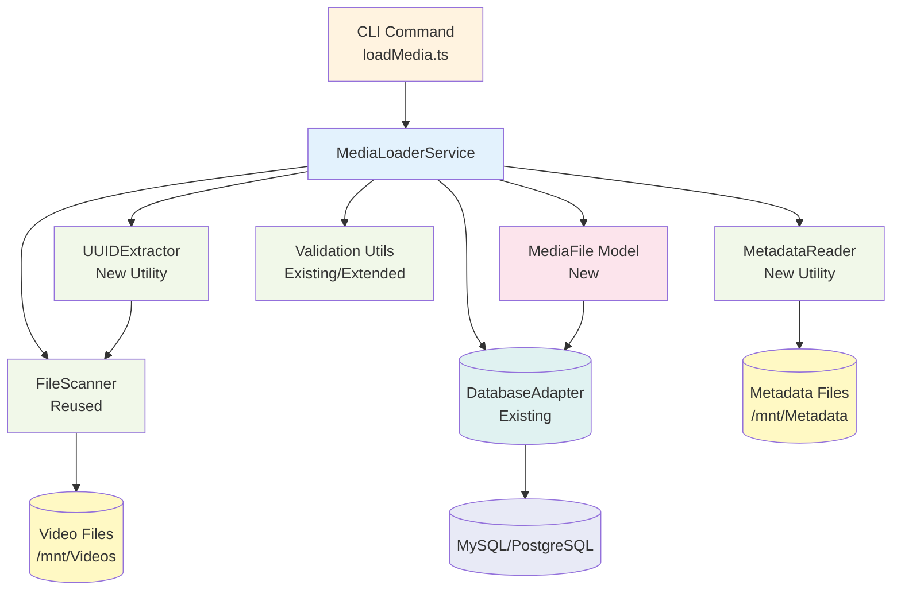

# Design Document

## Overview

The Media Metadata Loader is a backend utility system that automates the discovery, matching, and loading of video files with their associated metadata into the database. The system scans flat video directories (`/mnt/Videos`), extracts UUIDs from filenames, locates corresponding metadata files in nested directories (`/mnt/Metadata/{UUID}/*.info.json`), and persists the complete dataset to the database.

This feature integrates with the existing media player infrastructure, leveraging the database adapter pattern, service layer architecture, and validation utilities already established in the codebase. The loader can be executed as a CLI command or integrated into the server startup process.

## Steering Document Alignment

### Technical Standards (tech.md)

- **Database Abstraction**: Uses the existing `DatabaseAdapter` interface to support both MySQL and PostgreSQL
- **TypeScript Strict Mode**: All code follows strict TypeScript typing with interfaces and type guards
- **Service Layer Pattern**: Business logic encapsulated in dedicated service classes with single responsibility
- **Error Handling**: Comprehensive error handling with logging and graceful degradation
- **Dependency Injection**: Services accept dependencies through constructors, enabling testability
- **Validation**: Input validation using existing validation utilities

### Project Structure (structure.md)

Implementation follows the established project structure:

```
backend/src/
├── models/             # MediaFile model with database row mapping
├── services/           # MediaLoaderService for orchestration
├── utils/              # UUIDExtractor, MetadataReader utilities
├── adapters/           # Uses existing DatabaseAdapter
├── cli/                # New CLI command for media loading (optional)
└── types/              # TypeScript interfaces and types
```

## Code Reuse Analysis

### Existing Components to Leverage

- **FileScanner** (`utils/FileScanner.ts`): Reuse for video directory scanning
  - Already supports video file extension filtering
  - Handles recursive directory scanning
  - Returns `ScannedFile` objects with absolute/relative paths
  - Will extend with UUID extraction capability

- **DatabaseAdapter** (`adapters/DatabaseAdapter.ts`): Use existing interface
  - Supports parameterized queries for SQL injection prevention
  - Transaction support for atomic batch operations
  - Works with both MySQL and PostgreSQL

- **Validation Utilities** (`utils/validation.ts`): Reuse existing validators
  - `sanitizeFilePath` for path validation
  - Add new UUID validation function
  - Add JSON validation for metadata parsing

- **VideoService Pattern** (`services/VideoService.ts`): Follow similar architecture
  - Service class with adapter dependency injection
  - Row-to-model conversion pattern
  - Batch processing with error handling
  - Progress logging

- **Video Model** (`models/Video.ts`): Extend or reference
  - `customMetadata` field already supports flexible JSON storage
  - Consider adding `metadataSource` field to track metadata file paths

### Integration Points

- **Database Schema**: Extend `videos` table or create new `media_files` table
  - Option 1: Add `uuid` and `metadata_file_path` columns to existing `videos` table
  - Option 2: Create new `media_files` table with full UUID/metadata tracking
  - Decision: Option 1 for simplicity (aligns with REQ-5 flexible storage)

- **Existing Video Scanner**: `VideoService.scanVideos` method
  - Similar workflow: scan → extract metadata → insert
  - Can share common patterns and utilities
  - Media loader focuses on UUID-based metadata matching

- **CLI Integration**: Follow `server.ts` startup pattern
  - Create `cli/loadMedia.ts` command script
  - Use environment variables for configuration
  - Support dry-run mode for testing

## Architecture

### Modular Design Principles

- **Single File Responsibility**: Each utility handles one specific concern
  - `UUIDExtractor`: UUID pattern matching and extraction only
  - `MetadataReader`: JSON file reading and parsing only
  - `MediaLoaderService`: Orchestrates the loading workflow only
  - `MediaFileModel`: Data structure definitions only

- **Component Isolation**: Utilities are independent and testable
  - No cross-dependencies between utilities
  - Each utility can be unit tested in isolation
  - Services depend on utilities through clear interfaces

- **Service Layer Separation**: Clear separation of concerns
  - Utilities: Pure functions and focused classes (no business logic)
  - Service: Orchestration and business logic (uses utilities)
  - CLI: User interface and command-line handling (uses service)

- **Utility Modularity**: Small, focused, reusable modules
  - Each utility exports a single class or set of related functions
  - Clear input/output contracts
  - No side effects except logging

### System Architecture



### Data Flow

1. **Discovery Phase**:
   - CLI invokes `MediaLoaderService.loadMedia()`
   - Service uses `FileScanner` to scan `/mnt/Videos`
   - Returns list of `ScannedFile` objects

2. **UUID Extraction Phase**:
   - For each scanned file, use `UUIDExtractor.extract(filename)`
   - Returns UUID string or null (if no valid UUID found)
   - Log warnings for files without valid UUIDs

3. **Metadata Matching Phase**:
   - For each UUID, use `MetadataReader.findMetadataFile(metadataPath, uuid)`
   - Checks `/mnt/Metadata/{UUID}/` directory
   - Returns path to `*.info.json` file or null

4. **Metadata Parsing Phase**:
   - For each metadata file, use `MetadataReader.parseMetadata(filePath)`
   - Parses JSON and validates structure
   - Returns parsed JSON object or throws error

5. **Database Storage Phase**:
   - Create `MediaFileRow` object with all data
   - Check for existing record using UUID (idempotency)
   - Insert or update via `DatabaseAdapter.execute()`
   - Use transactions for batch operations

6. **Reporting Phase**:
   - Collect statistics during processing
   - Generate final summary report
   - Log all errors and warnings

## Components and Interfaces

### Component 1: UUIDExtractor

- **Purpose:** Extract UUIDs from video filenames using regex pattern matching
- **File:** `backend/src/utils/UUIDExtractor.ts`
- **Interfaces:**
  ```typescript
  export class UUIDExtractor {
    // Extract UUID from filename (first valid UUID found)
    static extract(filename: string): string | null;

    // Validate UUID v4 format
    static isValidUUID(uuid: string): boolean;

    // Extract all UUIDs from filename (for files with multiple UUIDs)
    static extractAll(filename: string): string[];
  }
  ```
- **Dependencies:** None (pure utility)
- **Reuses:** None (new utility)
- **Implementation Notes:**
  - UUID v4 format: `8-4-4-4-12` hexadecimal pattern
  - Regex pattern: `/[0-9a-f]{8}-[0-9a-f]{4}-4[0-9a-f]{3}-[89ab][0-9a-f]{3}-[0-9a-f]{12}/gi`
  - Case-insensitive matching
  - Returns first valid UUID found, or null

### Component 2: MetadataReader

- **Purpose:** Locate and parse metadata JSON files from nested directory structure
- **File:** `backend/src/utils/MetadataReader.ts`
- **Interfaces:**
  ```typescript
  export interface MetadataFile {
    filePath: string;           // Absolute path to metadata file
    content: Record<string, unknown>;  // Parsed JSON content
    fileSize: number;           // File size in bytes
    modifiedAt: Date;           // Last modified timestamp
  }

  export class MetadataReader {
    constructor(metadataBasePath: string);

    // Find metadata file for a given UUID
    async findMetadataFile(uuid: string): Promise<string | null>;

    // Read and parse metadata JSON file
    async readMetadata(filePath: string): Promise<MetadataFile>;

    // Combined: find and read in one operation
    async getMetadataForUUID(uuid: string): Promise<MetadataFile | null>;
  }
  ```
- **Dependencies:** `fs/promises`, `path`
- **Reuses:** None (new utility)
- **Implementation Notes:**
  - Checks for directory: `/mnt/Metadata/{UUID}/`
  - Searches for `*.info.json` files (case-insensitive)
  - Returns first `.info.json` file found alphabetically
  - Validates JSON parsability
  - Throws descriptive errors for file not found, permission errors, malformed JSON

### Component 3: MediaLoaderService

- **Purpose:** Orchestrate the media file loading workflow with progress tracking and error handling
- **File:** `backend/src/services/MediaLoaderService.ts`
- **Interfaces:**
  ```typescript
  export interface MediaLoaderOptions {
    videoPath: string;          // Path to video files (default: /mnt/Videos)
    metadataPath: string;       // Path to metadata files (default: /mnt/Metadata)
    batchSize: number;          // Batch size for processing (default: 100)
    dryRun: boolean;            // Preview mode, no database writes (default: false)
    verbose: boolean;           // Enable debug logging (default: false)
  }

  export interface LoaderStatistics {
    totalFilesFound: number;
    successCount: number;
    failedCount: number;
    missingMetadataCount: number;
    alreadyExistsCount: number;
    processingTimeMs: number;
    errors: Array<{ file: string; error: string }>;
  }

  export class MediaLoaderService {
    constructor(
      adapter: DatabaseAdapter,
      options: Partial<MediaLoaderOptions>
    );

    // Main entry point: load all media files
    async loadMedia(): Promise<LoaderStatistics>;

    // Process a single video file
    private async processVideoFile(
      scannedFile: ScannedFile
    ): Promise<'success' | 'failed' | 'missing-metadata' | 'already-exists'>;

    // Check if media file already exists in database
    private async checkExisting(uuid: string): Promise<boolean>;

    // Insert or update media file in database
    private async upsertMediaFile(data: MediaFileData): Promise<void>;

    // Generate progress report
    private logProgress(current: number, total: number): void;
  }
  ```
- **Dependencies:** `DatabaseAdapter`, `FileScanner`, `UUIDExtractor`, `MetadataReader`
- **Reuses:** `FileScanner`, `DatabaseAdapter`, validation utilities
- **Implementation Notes:**
  - Follows `VideoService` pattern for consistency
  - Batch processing with configurable batch sizes
  - Progress logging every 10 files processed
  - Continue processing on individual file failures
  - Use transactions for batch inserts (commit every batch)
  - Idempotent: safe to re-run multiple times

### Component 4: MediaFile Model

- **Purpose:** Define data structures for media files with metadata
- **File:** `backend/src/models/MediaFile.ts`
- **Interfaces:**
  ```typescript
  export interface MediaFile {
    readonly id: number;
    uuid: string;               // Video file UUID (unique)
    filePath: string;           // Relative path to video file
    absolutePath: string;       // Absolute path to video file
    fileSize: number;           // Video file size in bytes
    extension: string;          // File extension (.mp4, etc.)

    metadataFilePath: string | null;  // Path to metadata JSON file
    metadata: Record<string, unknown>; // Parsed metadata JSON

    readonly createdAt: Date;
    updatedAt: Date;
    isAvailable: boolean;       // File exists and is accessible
  }

  export interface MediaFileRow {
    id: number;
    uuid: string;
    file_path: string;
    absolute_path: string;
    file_size: number;
    extension: string;
    metadata_file_path: string | null;
    metadata: string;           // JSON string in database
    created_at: Date;
    updated_at: Date;
    is_available: boolean;
  }

  export interface CreateMediaFileInput {
    uuid: string;
    filePath: string;
    absolutePath: string;
    fileSize: number;
    extension: string;
    metadataFilePath?: string | null;
    metadata: Record<string, unknown>;
  }
  ```
- **Dependencies:** None
- **Reuses:** Pattern from `Video` model
- **Implementation Notes:**
  - UUID is unique constraint in database
  - Metadata stored as JSONB (PostgreSQL) or JSON (MySQL)
  - Separate from `videos` table initially (can be merged later)
  - `isAvailable` flag for soft deletes

### Component 5: CLI Command

- **Purpose:** Command-line interface for executing the media loader
- **File:** `backend/src/cli/loadMedia.ts`
- **Interfaces:**
  ```typescript
  // Command-line interface
  async function main(): Promise<void>;

  // Parse command-line arguments
  function parseArgs(): MediaLoaderOptions;

  // Display help information
  function displayHelp(): void;
  ```
- **Dependencies:** `MediaLoaderService`, `DatabaseAdapter`, `dotenv`
- **Reuses:** `server.ts` initialization pattern
- **Implementation Notes:**
  - Use `process.argv` or `commander` library for argument parsing
  - Load database configuration from environment variables
  - Display progress bar or periodic status updates
  - Exit with status code 0 on success, non-zero on failure
  - Support flags: `--dry-run`, `--verbose`, `--video-path`, `--metadata-path`, `--batch-size`

## Data Models

### Database Schema Extension

Two options for database integration:

#### Option 1: New `media_files` Table (Recommended)

```sql
CREATE TABLE media_files (
  id INT AUTO_INCREMENT PRIMARY KEY,
  uuid VARCHAR(36) NOT NULL UNIQUE,
  file_path VARCHAR(512) NOT NULL,
  absolute_path VARCHAR(1024) NOT NULL,
  file_size BIGINT NOT NULL,
  extension VARCHAR(10) NOT NULL,
  metadata_file_path VARCHAR(1024),
  metadata JSON NOT NULL,
  created_at TIMESTAMP DEFAULT CURRENT_TIMESTAMP,
  updated_at TIMESTAMP DEFAULT CURRENT_TIMESTAMP ON UPDATE CURRENT_TIMESTAMP,
  is_available BOOLEAN DEFAULT TRUE,
  INDEX idx_uuid (uuid),
  INDEX idx_file_path (file_path),
  INDEX idx_created_at (created_at)
);
```

PostgreSQL version:
```sql
CREATE TABLE media_files (
  id SERIAL PRIMARY KEY,
  uuid UUID NOT NULL UNIQUE,
  file_path VARCHAR(512) NOT NULL,
  absolute_path VARCHAR(1024) NOT NULL,
  file_size BIGINT NOT NULL,
  extension VARCHAR(10) NOT NULL,
  metadata_file_path VARCHAR(1024),
  metadata JSONB NOT NULL,
  created_at TIMESTAMP DEFAULT CURRENT_TIMESTAMP,
  updated_at TIMESTAMP DEFAULT CURRENT_TIMESTAMP,
  is_available BOOLEAN DEFAULT TRUE
);

CREATE INDEX idx_media_uuid ON media_files(uuid);
CREATE INDEX idx_media_file_path ON media_files(file_path);
CREATE INDEX idx_media_created_at ON media_files(created_at);
CREATE INDEX idx_media_metadata ON media_files USING GIN(metadata);
```

#### Option 2: Extend `videos` Table

Add columns to existing `videos` table:
```sql
ALTER TABLE videos
  ADD COLUMN uuid VARCHAR(36) UNIQUE AFTER id,
  ADD COLUMN absolute_path VARCHAR(1024) AFTER file_path,
  ADD COLUMN extension VARCHAR(10) AFTER file_size,
  ADD COLUMN metadata_file_path VARCHAR(1024) AFTER custom_metadata,
  ADD INDEX idx_video_uuid (uuid);
```

**Decision:** Use Option 1 (separate table) for:
- Clearer separation of concerns
- Easier to extend/modify without affecting existing video table
- Supports future integration with `videos` table via UUID reference

### MediaFileData Structure

Internal data structure used during processing:

```typescript
interface MediaFileData {
  uuid: string;
  videoFile: ScannedFile;      // From FileScanner
  metadataFile: MetadataFile | null;  // From MetadataReader
  discoveredAt: Date;
}
```

## Error Handling

### Error Scenarios

1. **Video Directory Not Found**
   - **Handling:** Throw error immediately, do not proceed with processing
   - **User Impact:** CLI exits with error code 1 and clear error message
   - **Logging:** `ERROR: Video directory does not exist: /mnt/Videos`

2. **Metadata Directory Not Found**
   - **Handling:** Log warning and continue processing (all videos will have "missing metadata")
   - **User Impact:** Loader continues, all metadata marked as missing
   - **Logging:** `WARN: Metadata directory does not exist: /mnt/Metadata - all videos will have missing metadata`

3. **File Permission Errors**
   - **Handling:** Skip file, log error, continue with next file
   - **User Impact:** File not loaded, included in "failed" count
   - **Logging:** `ERROR: Permission denied reading file: /mnt/Videos/12345.mp4`

4. **Invalid UUID in Filename**
   - **Handling:** Log warning, skip file, continue processing
   - **User Impact:** File not loaded, not included in statistics
   - **Logging:** `WARN: No valid UUID found in filename: badfile.mp4`

5. **Metadata File Not Found**
   - **Handling:** Insert video with null metadata, increment "missing metadata" count
   - **User Impact:** Video loaded but metadata_file_path and metadata are null/empty
   - **Logging:** `INFO: Metadata not found for UUID: 550e8400-e29b-41d4-a716-446655440000`

6. **Malformed Metadata JSON**
   - **Handling:** Log error with parse details, mark as failed, continue
   - **User Impact:** Video not loaded, included in "failed" count
   - **Logging:** `ERROR: Failed to parse metadata JSON for UUID: 550e8400... - Unexpected token at position 45`

7. **Database Connection Failure**
   - **Handling:** Throw error immediately, stop processing
   - **User Impact:** CLI exits with error code 1
   - **Logging:** `ERROR: Database connection lost - aborting media load`

8. **Database Insert Failure**
   - **Handling:** Log error, skip file, continue with next file
   - **User Impact:** File not loaded, included in "failed" count
   - **Logging:** `ERROR: Failed to insert media file UUID: 550e8400... - Duplicate entry`

9. **Transaction Rollback**
   - **Handling:** Log warning, retry batch or process individually
   - **User Impact:** Batch processing continues with smaller batches
   - **Logging:** `WARN: Transaction rollback for batch 1-100, retrying individually`

10. **Out of Memory**
    - **Handling:** Process in smaller batches, log warning
    - **User Impact:** Slower processing, but completes successfully
    - **Logging:** `WARN: Memory threshold reached, reducing batch size to 10`

### Error Recovery Strategies

- **Graceful Degradation**: Continue processing remaining files after individual failures
- **Transaction Boundaries**: Batch operations in transactions, rollback only failed batches
- **Retry Logic**: Retry database operations once on transient failures
- **Detailed Logging**: Log every error with context (file path, UUID, error details)
- **Summary Report**: Include all errors in final statistics report

## Testing Strategy

### Unit Testing

**Utilities to Test:**

1. **UUIDExtractor** (`utils/UUIDExtractor.test.ts`):
   - Valid UUID extraction from various filename formats
   - Invalid UUID patterns (too short, wrong format)
   - Multiple UUIDs in filename (should extract first)
   - Edge cases: no UUID, empty string, special characters
   - Case-insensitive matching

2. **MetadataReader** (`utils/MetadataReader.test.ts`):
   - Find metadata file in correct directory
   - Handle missing metadata directory
   - Handle missing `.info.json` file
   - Parse valid JSON successfully
   - Handle malformed JSON gracefully
   - Handle file permission errors
   - Handle multiple `.info.json` files (use first alphabetically)

3. **MediaLoaderService** (`services/MediaLoaderService.test.ts`):
   - Process single file successfully
   - Handle file with missing metadata
   - Handle file with invalid UUID
   - Batch processing with multiple files
   - Idempotency: re-running doesn't create duplicates
   - Dry-run mode: no database writes
   - Statistics calculation accuracy

**Mock Strategy:**
- Mock `DatabaseAdapter` for service tests
- Mock `fs/promises` for file system operations
- Use in-memory test data for unit tests
- No actual file system or database access in unit tests

### Integration Testing

**Test Scenarios:**

1. **Complete Loading Workflow** (`__tests__/integration/mediaLoader.integration.test.ts`):
   - Setup: Create test video files and metadata files in temp directories
   - Execute: Run `MediaLoaderService.loadMedia()`
   - Verify: Check database contains correct records with metadata
   - Cleanup: Remove test files and database records

2. **Database Transactions**:
   - Test batch processing with transaction commits
   - Test rollback on partial batch failure
   - Verify atomicity of batch operations

3. **Error Handling**:
   - Test with malformed metadata JSON files
   - Test with missing metadata directories
   - Test with database connection interruptions
   - Verify error counts in statistics

4. **Idempotency**:
   - Load same files twice
   - Verify no duplicate records created
   - Verify update behavior when metadata changes

**Test Database:**
- Use separate test database instance
- Reset database state before each test
- Use database migrations to create schema

### End-to-End Testing

**CLI Testing:**

1. **Successful Load Scenario**:
   - Create test video files with UUIDs in filenames
   - Create corresponding metadata directories and JSON files
   - Run CLI command: `node dist/cli/loadMedia.js --video-path /tmp/test-videos --metadata-path /tmp/test-metadata`
   - Verify: Exit code 0, success message, database populated

2. **Dry-Run Mode**:
   - Run CLI with `--dry-run` flag
   - Verify: No database writes, statistics printed, exit code 0

3. **Missing Metadata Scenario**:
   - Create video files without corresponding metadata
   - Run CLI command
   - Verify: Videos loaded with null metadata, "missing metadata" count > 0

4. **Invalid Input Scenario**:
   - Run CLI with non-existent video directory
   - Verify: Error message, exit code 1, no database writes

5. **Verbose Logging**:
   - Run CLI with `--verbose` flag
   - Verify: Detailed debug output for each file processed

**Manual Testing Checklist:**
- [ ] Load 100+ video files successfully
- [ ] Handle files with various UUID placements in filename
- [ ] Handle missing metadata gracefully
- [ ] Process large metadata JSON files (>1MB)
- [ ] Verify performance: 10+ files per second
- [ ] Test with MySQL and PostgreSQL
- [ ] Test progress reporting during long operations
- [ ] Test graceful shutdown (Ctrl+C) during processing

### Performance Testing

**Benchmarks:**
- Process 1,000 video files in < 100 seconds (10 files/sec)
- Memory usage < 500MB for 10,000 files
- Database transaction size: 100 files per batch

**Performance Monitoring:**
- Log processing time for each batch
- Track memory usage periodically
- Monitor database connection pool usage
- Report final statistics including processing time

## Migration Strategy

A new migration file will be created: `backend/src/migrations/00N_create_media_files_table.ts`

```typescript
import { DatabaseAdapter } from '../adapters/DatabaseAdapter';
import { Migration } from '../types/database';

export const migration: Migration = {
  version: 'N',
  name: 'create_media_files_table',
  description: 'Create media_files table for UUID-based media metadata storage',

  async up(adapter: DatabaseAdapter): Promise<void> {
    // Detect database type for SQL syntax differences
    const isMysql = true; // Detection logic here

    if (isMysql) {
      await adapter.execute(`
        CREATE TABLE media_files (
          id INT AUTO_INCREMENT PRIMARY KEY,
          uuid VARCHAR(36) NOT NULL UNIQUE,
          file_path VARCHAR(512) NOT NULL,
          absolute_path VARCHAR(1024) NOT NULL,
          file_size BIGINT NOT NULL,
          extension VARCHAR(10) NOT NULL,
          metadata_file_path VARCHAR(1024),
          metadata JSON NOT NULL,
          created_at TIMESTAMP DEFAULT CURRENT_TIMESTAMP,
          updated_at TIMESTAMP DEFAULT CURRENT_TIMESTAMP ON UPDATE CURRENT_TIMESTAMP,
          is_available BOOLEAN DEFAULT TRUE
        )
      `, []);

      await adapter.execute('CREATE INDEX idx_uuid ON media_files(uuid)', []);
      await adapter.execute('CREATE INDEX idx_file_path ON media_files(file_path)', []);
    } else {
      // PostgreSQL version
      await adapter.execute(`
        CREATE TABLE media_files (
          id SERIAL PRIMARY KEY,
          uuid UUID NOT NULL UNIQUE,
          file_path VARCHAR(512) NOT NULL,
          absolute_path VARCHAR(1024) NOT NULL,
          file_size BIGINT NOT NULL,
          extension VARCHAR(10) NOT NULL,
          metadata_file_path VARCHAR(1024),
          metadata JSONB NOT NULL,
          created_at TIMESTAMP DEFAULT CURRENT_TIMESTAMP,
          updated_at TIMESTAMP DEFAULT CURRENT_TIMESTAMP,
          is_available BOOLEAN DEFAULT TRUE
        )
      `, []);

      await adapter.execute('CREATE INDEX idx_uuid ON media_files(uuid)', []);
      await adapter.execute('CREATE INDEX idx_file_path ON media_files(file_path)', []);
      await adapter.execute('CREATE INDEX idx_metadata ON media_files USING GIN(metadata)', []);
    }
  },

  async down(adapter: DatabaseAdapter): Promise<void> {
    await adapter.execute('DROP TABLE IF EXISTS media_files', []);
  },
};
```

The migration will run automatically on server startup via the existing `MigrationRunner`.
