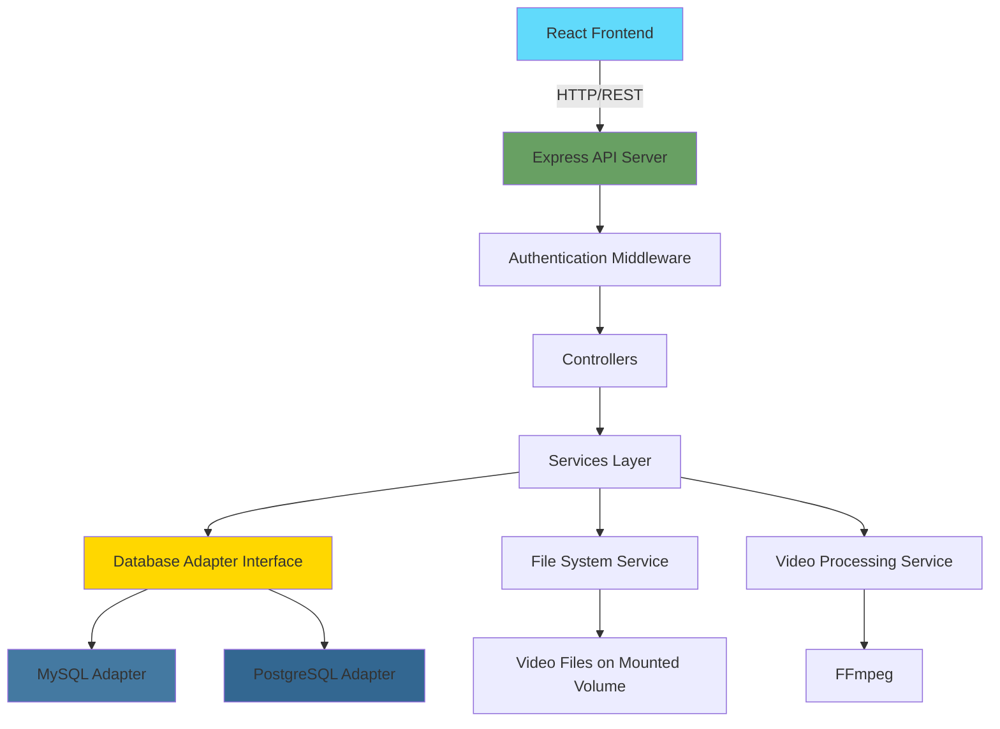

# Design Document

## Overview

This document outlines the technical design for a self-hosted web media player application built with TypeScript, Node.js, and React. The system follows a modern three-tier architecture with a REST API backend, React SPA frontend, and database abstraction layer supporting both MySQL and PostgreSQL. The application will be containerized using Docker and support HLS adaptive bitrate streaming for optimal video playback.

The design emphasizes modularity, testability, and maintainability through clear separation of concerns, the adapter pattern for database abstraction, and component-based frontend architecture.

## Steering Document Alignment

### Technical Standards (tech.md)

Since this is a new project, we'll establish the following technical standards:

- **Language**: TypeScript 5.x for type safety across frontend and backend
- **Backend Framework**: Express.js for REST API
- **Frontend Framework**: React 18+ with functional components and hooks
- **Database**: Support for MySQL 8+ and PostgreSQL 14+ via adapter pattern
- **Containerization**: Docker with multi-stage builds
- **Code Quality**: ESLint, Prettier, and strict TypeScript compiler options

### Project Structure (structure.md)

```
media-player/
├── backend/
│   ├── src/
│   │   ├── adapters/          # Database adapter implementations
│   │   ├── models/             # Data models and TypeScript interfaces
│   │   ├── services/           # Business logic layer
│   │   ├── controllers/        # API route handlers
│   │   ├── middleware/         # Express middleware (auth, validation, error handling)
│   │   ├── migrations/         # Database migration files
│   │   ├── utils/              # Utility functions
│   │   └── server.ts           # Application entry point
│   ├── Dockerfile
│   └── package.json
├── frontend/
│   ├── src/
│   │   ├── components/         # Reusable React components
│   │   ├── pages/              # Page-level components
│   │   ├── services/           # API client services
│   │   ├── hooks/              # Custom React hooks
│   │   ├── contexts/           # React context providers
│   │   ├── types/              # TypeScript type definitions
│   │   └── App.tsx             # Main application component
│   ├── Dockerfile
│   └── package.json
├── docker-compose.yml
└── README.md
```

## Code Reuse Analysis

Since this is a greenfield project, we'll establish reusable patterns and utilities from the start:

### Foundation Components to Create

- **DatabaseAdapter Interface**: Abstract interface for database operations
- **BaseController**: Common controller patterns (error handling, response formatting)
- **VideoScanner Service**: Reusable file system scanning logic
- **AuthMiddleware**: Authentication token validation
- **VideoPlayer Component**: Core player with extensible controls
- **APIClient Service**: Centralized HTTP client with error handling

### Integration Points

- **FFmpeg**: For video metadata extraction and HLS transcoding
- **bcrypt/argon2**: For password hashing
- **jsonwebtoken**: For session token generation
- **Video.js or ReactPlayer**: Base video player library to extend with custom controls

## Architecture

The application follows a three-tier architecture with clear separation between presentation, business logic, and data access layers.

### Modular Design Principles

- **Single File Responsibility**: Each service handles one domain (VideoService, ClipService, PlaylistService, AuthService)
- **Component Isolation**: React components are small and focused (VideoPlayer, ClipMarker, PlaylistEditor)
- **Service Layer Separation**: Controllers delegate business logic to services, services use database adapters
- **Utility Modularity**: Separate utilities for file operations, validation, error handling, and logging



### Technology Stack

**Backend:**
- **Runtime**: Node.js 20 LTS
- **Language**: TypeScript 5.x
- **Framework**: Express.js 4.x
- **Database**: MySQL 8+ OR PostgreSQL 14+
- **ORM/Query Builder**: None (raw SQL with parameterized queries for adapter pattern)
- **Authentication**: jsonwebtoken for JWT tokens
- **Password Hashing**: bcrypt (preferred for simplicity)
- **Video Processing**: FFmpeg (for metadata extraction, HLS generation)
- **Validation**: Joi or Zod for request validation

**Frontend:**
- **Framework**: React 18+
- **Language**: TypeScript 5.x
- **State Management**: React Context API + useReducer (start simple, can migrate to Redux if needed)
- **Video Player**: Video.js with custom controls OR ReactPlayer
- **HTTP Client**: Axios
- **Routing**: React Router 6
- **Styling**: CSS Modules or Styled Components
- **UI Components**: Build custom or use headless UI library (Radix UI, Headless UI)

**DevOps:**
- **Containerization**: Docker with multi-stage builds
- **Orchestration**: Docker Compose for local development
- **Environment Config**: dotenv for environment variables

## Components and Interfaces

### Backend Components

#### DatabaseAdapter (Interface)

**Purpose:** Abstract interface defining all database operations, allowing interchangeable MySQL and PostgreSQL implementations.

**Interfaces:**
```typescript
interface DatabaseAdapter {
  // Connection management
  connect(config: DatabaseConfig): Promise<void>;
  disconnect(): Promise<void>;

  // Migration management
  runMigrations(): Promise<void>;
  getMigrationHistory(): Promise<Migration[]>;

  // Query execution
  query<T>(sql: string, params: any[]): Promise<T[]>;
  execute(sql: string, params: any[]): Promise<{ affectedRows: number; insertId?: number }>;

  // Transaction support
  beginTransaction(): Promise<void>;
  commit(): Promise<void>;
  rollback(): Promise<void>;
}
```

**Dependencies:** Database driver (mysql2 or pg)

**Reuses:** N/A (foundation component)

#### MySQLAdapter & PostgreSQLAdapter (Implementations)

**Purpose:** Concrete implementations of DatabaseAdapter for MySQL and PostgreSQL.

**Interfaces:** Implements DatabaseAdapter interface

**Dependencies:** mysql2 OR pg driver

**Reuses:** DatabaseAdapter interface

#### VideoService

**Purpose:** Business logic for video management (scanning, metadata, CRUD operations).

**Interfaces:**
```typescript
class VideoService {
  scanVideos(mountPath: string): Promise<Video[]>;
  getVideoById(id: number): Promise<Video | null>;
  updateVideoMetadata(id: number, metadata: VideoMetadata): Promise<void>;
  searchVideos(criteria: SearchCriteria): Promise<Video[]>;
  deleteVideo(id: number): Promise<void>;
}
```

**Dependencies:** DatabaseAdapter, FileSystemService, FFmpegService

**Reuses:** DatabaseAdapter for persistence

#### ClipService

**Purpose:** Business logic for creating, managing, and playing clips.

**Interfaces:**
```typescript
class ClipService {
  createClip(videoId: number, startTime: number, endTime: number, metadata: ClipMetadata): Promise<Clip>;
  getClipById(id: number): Promise<Clip | null>;
  getClipsByVideo(videoId: number): Promise<Clip[]>;
  updateClipMetadata(id: number, metadata: ClipMetadata): Promise<void>;
  deleteClip(id: number): Promise<void>;
}
```

**Dependencies:** DatabaseAdapter, VideoService

**Reuses:** DatabaseAdapter for persistence, VideoService for source video validation

#### PlaylistService

**Purpose:** Business logic for playlist creation and management.

**Interfaces:**
```typescript
class PlaylistService {
  createPlaylist(name: string, description: string): Promise<Playlist>;
  addClipToPlaylist(playlistId: number, clipId: number, order: number): Promise<void>;
  removeClipFromPlaylist(playlistId: number, clipId: number): Promise<void>;
  reorderPlaylist(playlistId: number, clipOrders: Array<{clipId: number, order: number}>): Promise<void>;
  getPlaylistById(id: number): Promise<Playlist | null>;
  deletePlaylist(id: number): Promise<void>;
}
```

**Dependencies:** DatabaseAdapter, ClipService

**Reuses:** DatabaseAdapter for persistence, ClipService for clip validation

#### AuthService

**Purpose:** User authentication, session management, and password handling.

**Interfaces:**
```typescript
class AuthService {
  login(username: string, password: string): Promise<{ token: string; user: User }>;
  validateToken(token: string): Promise<User | null>;
  createUser(username: string, password: string): Promise<User>;
  changePassword(userId: number, oldPassword: string, newPassword: string): Promise<void>;
}
```

**Dependencies:** DatabaseAdapter, bcrypt, jsonwebtoken

**Reuses:** DatabaseAdapter for user persistence

#### VideoStreamingService

**Purpose:** Handle video streaming with HLS support and clip-specific time ranges.

**Interfaces:**
```typescript
class VideoStreamingService {
  streamVideo(videoId: number, range?: string): Promise<ReadableStream>;
  streamClip(clipId: number): Promise<ReadableStream>;
  generateHLSManifest(videoId: number): Promise<string>;
  getHLSSegment(videoId: number, segmentIndex: number): Promise<Buffer>;
}
```

**Dependencies:** FileSystemService, FFmpegService

**Reuses:** FileSystemService for file access

#### MigrationRunner

**Purpose:** Manage database schema migrations with version tracking.

**Interfaces:**
```typescript
class MigrationRunner {
  runPendingMigrations(adapter: DatabaseAdapter): Promise<void>;
  getMigrationStatus(adapter: DatabaseAdapter): Promise<MigrationStatus[]>;
}
```

**Dependencies:** DatabaseAdapter

**Reuses:** DatabaseAdapter interface

### Frontend Components

#### VideoPlayer

**Purpose:** Core video player component with playback controls and clip marking UI.

**Props:**
```typescript
interface VideoPlayerProps {
  videoId: number;
  clipId?: number;
  onClipCreate?: (startTime: number, endTime: number) => void;
  showClipMarkers?: boolean;
}
```

**Dependencies:** Video.js or ReactPlayer library

**Reuses:** VideoService API client

#### ClipMarkerTimeline

**Purpose:** Visual timeline showing clip markers on the video progress bar.

**Props:**
```typescript
interface ClipMarkerTimelineProps {
  clips: Clip[];
  currentTime: number;
  duration: number;
  onMarkerClick: (clip: Clip) => void;
}
```

**Dependencies:** None (pure presentation)

**Reuses:** N/A

#### SearchFilterPanel

**Purpose:** Advanced search and filter interface with multiple criteria support.

**Props:**
```typescript
interface SearchFilterPanelProps {
  onSearch: (criteria: SearchCriteria) => void;
  availableMetadataFields: MetadataField[];
}
```

**Dependencies:** Form management library (React Hook Form)

**Reuses:** VideoService API client

#### PlaylistEditor

**Purpose:** Drag-and-drop interface for creating and reordering playlists.

**Props:**
```typescript
interface PlaylistEditorProps {
  playlistId: number;
  onSave: (playlist: Playlist) => void;
}
```

**Dependencies:** Drag-and-drop library (react-beautiful-dnd or @dnd-kit)

**Reuses:** PlaylistService API client, ClipService API client

#### LoginForm

**Purpose:** User authentication form.

**Props:**
```typescript
interface LoginFormProps {
  onLoginSuccess: (user: User, token: string) => void;
}
```

**Dependencies:** Form management library

**Reuses:** AuthService API client

## Data Models

### Video
```typescript
interface Video {
  id: number;
  filePath: string;              // Relative path from mount point
  title: string;
  description: string | null;
  tags: string[];                // Stored as JSON array
  duration: number;              // Seconds
  resolution: string;            // e.g., "1920x1080"
  codec: string;                 // e.g., "h264"
  fileSize: number;              // Bytes
  createdAt: Date;
  updatedAt: Date;
  isAvailable: boolean;          // False if file no longer exists
  customMetadata: Record<string, any>; // JSON field for extensibility
}
```

**Database Tables:**
```sql
-- MySQL/PostgreSQL compatible schema
CREATE TABLE videos (
  id INT AUTO_INCREMENT PRIMARY KEY,           -- PostgreSQL: SERIAL PRIMARY KEY
  file_path VARCHAR(512) NOT NULL UNIQUE,
  title VARCHAR(255) NOT NULL,
  description TEXT,
  tags JSON,                                   -- PostgreSQL: JSONB
  duration DECIMAL(10, 2) NOT NULL,
  resolution VARCHAR(50),
  codec VARCHAR(50),
  file_size BIGINT,
  created_at TIMESTAMP DEFAULT CURRENT_TIMESTAMP,
  updated_at TIMESTAMP DEFAULT CURRENT_TIMESTAMP ON UPDATE CURRENT_TIMESTAMP,
  is_available BOOLEAN DEFAULT TRUE,
  custom_metadata JSON,                        -- PostgreSQL: JSONB
  INDEX idx_title (title),
  INDEX idx_created_at (created_at)
);
```

### Clip
```typescript
interface Clip {
  id: number;
  videoId: number;
  name: string;
  description: string | null;
  startTime: number;             // Seconds from video start
  endTime: number;               // Seconds from video start
  duration: number;              // Calculated: endTime - startTime
  inheritedMetadata: Record<string, any>;  // Metadata copied from source video
  customMetadata: Record<string, any>;     // Clip-specific metadata
  createdAt: Date;
  updatedAt: Date;
}
```

**Database Tables:**
```sql
CREATE TABLE clips (
  id INT AUTO_INCREMENT PRIMARY KEY,           -- PostgreSQL: SERIAL PRIMARY KEY
  video_id INT NOT NULL,
  name VARCHAR(255) NOT NULL,
  description TEXT,
  start_time DECIMAL(10, 2) NOT NULL,
  end_time DECIMAL(10, 2) NOT NULL,
  duration DECIMAL(10, 2) GENERATED ALWAYS AS (end_time - start_time) STORED,
  inherited_metadata JSON,                     -- PostgreSQL: JSONB
  custom_metadata JSON,                        -- PostgreSQL: JSONB
  created_at TIMESTAMP DEFAULT CURRENT_TIMESTAMP,
  updated_at TIMESTAMP DEFAULT CURRENT_TIMESTAMP ON UPDATE CURRENT_TIMESTAMP,
  FOREIGN KEY (video_id) REFERENCES videos(id) ON DELETE CASCADE,
  INDEX idx_video_id (video_id),
  CONSTRAINT chk_time_range CHECK (start_time < end_time)
);
```

### Playlist
```typescript
interface Playlist {
  id: number;
  name: string;
  description: string | null;
  createdAt: Date;
  updatedAt: Date;
  clips: PlaylistClip[];         // Ordered list of clips
}

interface PlaylistClip {
  clipId: number;
  order: number;
  clip?: Clip;                   // Populated via join
}
```

**Database Tables:**
```sql
CREATE TABLE playlists (
  id INT AUTO_INCREMENT PRIMARY KEY,           -- PostgreSQL: SERIAL PRIMARY KEY
  name VARCHAR(255) NOT NULL,
  description TEXT,
  created_at TIMESTAMP DEFAULT CURRENT_TIMESTAMP,
  updated_at TIMESTAMP DEFAULT CURRENT_TIMESTAMP ON UPDATE CURRENT_TIMESTAMP,
  INDEX idx_name (name)
);

CREATE TABLE playlist_clips (
  playlist_id INT NOT NULL,
  clip_id INT NOT NULL,
  order_index INT NOT NULL,
  PRIMARY KEY (playlist_id, clip_id),
  FOREIGN KEY (playlist_id) REFERENCES playlists(id) ON DELETE CASCADE,
  FOREIGN KEY (clip_id) REFERENCES clips(id) ON DELETE CASCADE,
  INDEX idx_order (playlist_id, order_index)
);
```

### User
```typescript
interface User {
  id: number;
  username: string;
  passwordHash: string;
  createdAt: Date;
  lastLogin: Date | null;
}
```

**Database Tables:**
```sql
CREATE TABLE users (
  id INT AUTO_INCREMENT PRIMARY KEY,           -- PostgreSQL: SERIAL PRIMARY KEY
  username VARCHAR(100) NOT NULL UNIQUE,
  password_hash VARCHAR(255) NOT NULL,
  created_at TIMESTAMP DEFAULT CURRENT_TIMESTAMP,
  last_login TIMESTAMP NULL,
  INDEX idx_username (username)
);
```

### Migration
```typescript
interface Migration {
  id: number;
  version: string;
  name: string;
  executedAt: Date;
}
```

**Database Tables:**
```sql
CREATE TABLE migrations (
  id INT AUTO_INCREMENT PRIMARY KEY,           -- PostgreSQL: SERIAL PRIMARY KEY
  version VARCHAR(50) NOT NULL UNIQUE,
  name VARCHAR(255) NOT NULL,
  executed_at TIMESTAMP DEFAULT CURRENT_TIMESTAMP
);
```

## API Design

### REST Endpoints

**Authentication:**
- `POST /api/auth/login` - Authenticate user, returns JWT token
- `POST /api/auth/logout` - Invalidate session (client-side token removal)
- `GET /api/auth/validate` - Validate token, returns user info

**Videos:**
- `GET /api/videos` - List videos with pagination and filtering
- `GET /api/videos/:id` - Get video details
- `PATCH /api/videos/:id/metadata` - Update video metadata
- `DELETE /api/videos/:id` - Delete video (soft delete, keeps metadata)
- `POST /api/videos/scan` - Trigger video library scan
- `GET /api/videos/search` - Advanced search with query parameters

**Clips:**
- `GET /api/clips` - List all clips (with optional video filter)
- `GET /api/clips/:id` - Get clip details
- `POST /api/clips` - Create new clip
- `PATCH /api/clips/:id/metadata` - Update clip metadata
- `DELETE /api/clips/:id` - Delete clip

**Playlists:**
- `GET /api/playlists` - List all playlists
- `GET /api/playlists/:id` - Get playlist with ordered clips
- `POST /api/playlists` - Create new playlist
- `PUT /api/playlists/:id` - Update playlist name/description
- `DELETE /api/playlists/:id` - Delete playlist
- `POST /api/playlists/:id/clips` - Add clip to playlist
- `DELETE /api/playlists/:id/clips/:clipId` - Remove clip from playlist
- `PATCH /api/playlists/:id/reorder` - Reorder playlist clips

**Streaming:**
- `GET /api/stream/video/:id` - Stream video file (supports Range headers)
- `GET /api/stream/clip/:id` - Stream clip (specific time range)
- `GET /api/stream/playlist/:id` - Stream playlist (concatenated clips)
- `GET /api/stream/hls/:id/manifest.m3u8` - HLS manifest for video
- `GET /api/stream/hls/:id/:segment.ts` - HLS segment

## Database Adapter Pattern Implementation

The adapter pattern ensures the application can work with either MySQL or PostgreSQL without code changes in the business logic layer.

### Adapter Factory

```typescript
// adapters/index.ts
export function createDatabaseAdapter(type: 'mysql' | 'postgresql', config: DatabaseConfig): DatabaseAdapter {
  switch (type) {
    case 'mysql':
      return new MySQLAdapter(config);
    case 'postgresql':
      return new PostgreSQLAdapter(config);
    default:
      throw new Error(`Unsupported database type: ${type}`);
  }
}
```

### SQL Dialect Translation

Each adapter translates common operations to database-specific syntax:

**MySQL:**
- Auto-increment: `AUTO_INCREMENT`
- JSON type: `JSON`
- Last insert ID: `connection.insertId`
- Parameter placeholder: `?`

**PostgreSQL:**
- Auto-increment: `SERIAL`
- JSON type: `JSONB` (for better performance)
- Last insert ID: `RETURNING id`
- Parameter placeholder: `$1, $2, $3...`

### Migration Files

Migration files include both MySQL and PostgreSQL compatible SQL or use adapter methods:

```typescript
// migrations/001_initial_schema.ts
export async function up(adapter: DatabaseAdapter): Promise<void> {
  const isMySQL = adapter.constructor.name === 'MySQLAdapter';

  const createVideosTable = isMySQL
    ? `CREATE TABLE videos (
        id INT AUTO_INCREMENT PRIMARY KEY,
        file_path VARCHAR(512) NOT NULL UNIQUE,
        ...
      )`
    : `CREATE TABLE videos (
        id SERIAL PRIMARY KEY,
        file_path VARCHAR(512) NOT NULL UNIQUE,
        ...
      )`;

  await adapter.execute(createVideosTable, []);
}
```

## Video Streaming Approach

### HLS Adaptive Bitrate Streaming

1. **Video Ingestion:**
   - When videos are scanned, FFmpeg extracts metadata
   - Optionally pre-generate HLS segments for common videos

2. **On-Demand Transcoding:**
   - Generate HLS manifest and segments on-demand
   - Cache generated segments to disk
   - Serve segments as static files

3. **Clip Streaming:**
   - For clips, extract specific time range using FFmpeg
   - Generate temporary HLS segments for the clip time range
   - Stream to client

4. **Playlist Streaming:**
   - Concatenate clip segments in playlist order
   - Generate master manifest pointing to clip segments

### FFmpeg Integration

```typescript
// services/FFmpegService.ts
class FFmpegService {
  extractMetadata(filePath: string): Promise<VideoMetadata>;
  generateHLSSegments(filePath: string, outputDir: string): Promise<void>;
  extractClipSegment(filePath: string, startTime: number, endTime: number, outputPath: string): Promise<void>;
}
```

## Error Handling

### Error Scenarios

1. **Database Connection Failure**
   - **Handling:** Retry connection with exponential backoff (3 attempts)
   - **User Impact:** Display "Service temporarily unavailable" message

2. **Video File Not Found**
   - **Handling:** Mark video as unavailable in database, return 404
   - **User Impact:** Display "Video unavailable" with option to hide unavailable videos

3. **Invalid Clip Time Range**
   - **Handling:** Validate start < end and both within video duration, return 400 with validation errors
   - **User Impact:** Display validation error in clip creation form

4. **Migration Failure**
   - **Handling:** Rollback transaction, log error details, prevent application startup
   - **User Impact:** Application doesn't start, admin sees error logs

5. **Authentication Failure**
   - **Handling:** Return 401 Unauthorized, don't reveal whether username or password was incorrect
   - **User Impact:** Display "Invalid credentials" message

6. **Insufficient Permissions (File System)**
   - **Handling:** Log error, skip file during scanning, continue processing
   - **User Impact:** Admin notification of skipped files

7. **FFmpeg Processing Error**
   - **Handling:** Log error, return 500 with generic message
   - **User Impact:** Display "Video processing failed" message

## Testing Strategy

### Unit Testing

- **Framework:** Jest with ts-jest
- **Coverage Goal:** 80%+ for services and utilities

**Key Components to Test:**
- DatabaseAdapter implementations (use in-memory SQLite for tests)
- Service classes (VideoService, ClipService, etc.) with mocked adapters
- Utility functions (validation, time formatting, search query building)
- Middleware (authentication, error handling)

### Integration Testing

- **Framework:** Jest + Supertest for API testing
- **Database:** Use Docker containers for MySQL and PostgreSQL test instances

**Key Flows to Test:**
- Full authentication flow (login, token validation, protected routes)
- Video scanning and metadata extraction
- Clip creation with metadata inheritance
- Playlist creation and playback order
- Search and filtering with complex criteria
- Migration execution and rollback

### End-to-End Testing

- **Framework:** Playwright or Cypress
- **Environment:** Docker Compose with test database

**User Scenarios to Test:**
1. User logs in, browses video library, plays a video
2. User creates clips from a video, adds metadata
3. User creates a playlist, reorders clips, plays playlist
4. User searches for videos using multiple filters
5. User edits clip metadata without affecting source video

### Test Environment

Use Docker Compose to spin up test environment:
```yaml
version: '3.8'
services:
  mysql-test:
    image: mysql:8
    environment:
      MYSQL_ROOT_PASSWORD: test
      MYSQL_DATABASE: media_player_test

  postgres-test:
    image: postgres:14
    environment:
      POSTGRES_PASSWORD: test
      POSTGRES_DB: media_player_test
```

## Performance Considerations

1. **Database Indexing:**
   - Index on video.title, video.created_at, video.is_available
   - Index on clip.video_id for fast clip lookups
   - Index on playlist_clips (playlist_id, order_index) for ordered retrieval

2. **Video Streaming:**
   - Use HTTP Range headers for seeking support
   - Cache HLS segments on disk
   - Implement CDN-ready headers (Cache-Control)

3. **Search Optimization:**
   - For large libraries (>10k videos), consider full-text search indexes (MySQL: FULLTEXT, PostgreSQL: tsvector)
   - Implement pagination with cursor-based pagination for better performance

4. **File System Scanning:**
   - Use batch processing with configurable batch size
   - Implement incremental scanning (only check changed files)
   - Store file modification timestamps to detect changes

## Security Considerations

1. **Authentication:**
   - Use bcrypt with minimum 12 rounds for password hashing
   - JWT tokens with short expiration (15 minutes) + refresh token pattern
   - HTTP-only, secure cookies for token storage

2. **Input Validation:**
   - Validate all user inputs with Joi/Zod schemas
   - Sanitize file paths to prevent directory traversal
   - Parameterized queries to prevent SQL injection

3. **File Access:**
   - Restrict file reading to configured mount paths only
   - Validate file extensions before processing
   - Use read-only Docker volume mounts for video files

4. **Rate Limiting:**
   - Implement rate limiting on authentication endpoints (5 attempts per 15 minutes)
   - Rate limit search endpoints to prevent abuse

5. **CORS:**
   - Configure CORS to only allow frontend origin
   - In production, use same-origin or specific domain whitelist

## Deployment Architecture

### Docker Compose Setup

```yaml
version: '3.8'
services:
  backend:
    build: ./backend
    ports:
      - "3000:3000"
    environment:
      - DB_TYPE=mysql
      - DB_HOST=db
      - DB_PORT=3306
      - DB_NAME=media_player
      - DB_USER=root
      - DB_PASSWORD=${DB_PASSWORD}
      - JWT_SECRET=${JWT_SECRET}
    volumes:
      - /path/to/videos:/media:ro
      - hls-cache:/app/cache
    depends_on:
      - db

  frontend:
    build: ./frontend
    ports:
      - "80:80"
    depends_on:
      - backend

  db:
    image: mysql:8
    environment:
      - MYSQL_ROOT_PASSWORD=${DB_PASSWORD}
      - MYSQL_DATABASE=media_player
    volumes:
      - db-data:/var/lib/mysql

volumes:
  db-data:
  hls-cache:
```

### Environment Configuration

```env
# .env.example
DB_TYPE=mysql  # or postgresql
DB_HOST=localhost
DB_PORT=3306   # or 5432 for PostgreSQL
DB_NAME=media_player
DB_USER=root
DB_PASSWORD=changeme
JWT_SECRET=your-secret-key-here
VIDEO_MOUNT_PATH=/media
PORT=3000
```
