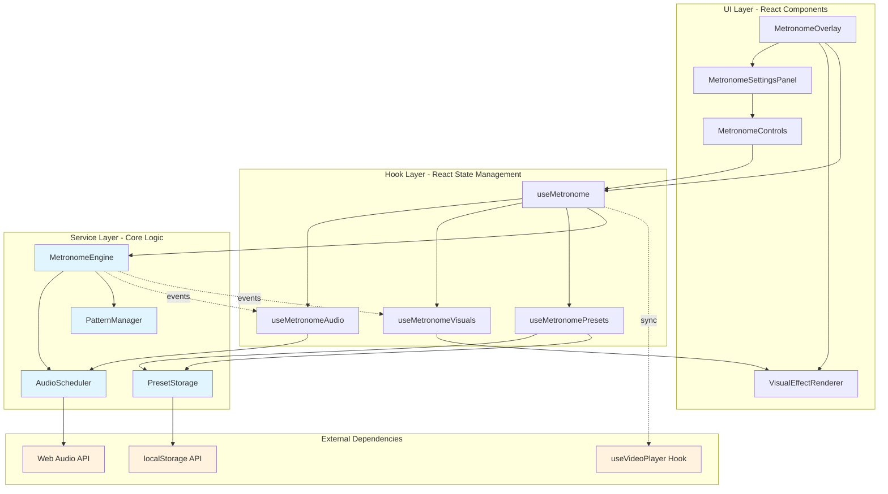

# Design Document

## Overview

The Metronome Overlay feature integrates a synchronized audio and visual metronome system into the existing Video.js-based video player. The design follows the project's modular architecture by creating isolated, reusable components with clear separation of concerns. The metronome operates independently yet synchronizes with video playback state (play/pause/seek) through the existing `useVideoPlayer` hook.

The implementation consists of four primary layers:
1. **Core Engine Layer**: Timing engine using Web Audio API for precision beat scheduling
2. **Audio Layer**: Configurable audio playback with multiple sound options and volume control
3. **Visual Layer**: Pluggable visual effect renderers (flash, pulse, border, custom shapes)
4. **UI Layer**: Settings panel integrated into VideoPlayer with real-time controls

This architecture ensures the metronome can be easily tested, extended, and maintained independently of the video player while providing seamless integration.

## Steering Document Alignment

### Technical Standards (tech.md)

_Note: No steering documents exist yet. This design follows established patterns found in the codebase:_

- **TypeScript Strict Mode**: Full type safety with interfaces for all configurations
- **React Functional Components**: All components use hooks, no class components
- **Custom Hooks Pattern**: Follows the existing `useVideoPlayer` pattern for state management
- **CSS Modules/Scoped Styles**: Component-specific CSS files matching existing `VideoPlayer.css` pattern
- **Error Handling**: Graceful degradation with user-friendly error messages
- **Testing**: Unit tests for hooks/utilities, component tests for React components, E2E tests for workflows

### Project Structure (structure.md)

_Note: No steering documents exist yet. This design follows the existing project organization:_

The implementation will follow the established frontend structure:
```
frontend/src/
├── components/
│   ├── VideoPlayer.tsx (existing - will be modified)
│   ├── MetronomeOverlay.tsx (new)
│   ├── MetronomeControls.tsx (new)
│   ├── MetronomeSettingsPanel.tsx (new)
│   └── visualEffects/ (new directory)
│       ├── FlashEffect.tsx
│       ├── PulseEffect.tsx
│       ├── BorderEffect.tsx
│       └── VisualEffectFactory.tsx
├── hooks/
│   ├── useVideoPlayer.ts (existing - no changes)
│   ├── useMetronome.ts (new)
│   ├── useMetronomeAudio.ts (new)
│   ├── useMetronomeVisuals.ts (new)
│   └── useMetronomePresets.ts (new)
├── services/
│   ├── metronome/
│   │   ├── MetronomeEngine.ts (new - core timing logic)
│   │   ├── AudioScheduler.ts (new - Web Audio API wrapper)
│   │   ├── PatternManager.ts (new - pattern processing)
│   │   └── PresetStorage.ts (new - localStorage management)
├── types/
│   └── metronome.ts (new - all TypeScript interfaces)
└── utils/
    └── metronome/
        ├── timingCalculations.ts (new - BPM/timing math)
        └── audioLoader.ts (new - custom sound loading)
```

## Code Reuse Analysis

### Existing Components to Leverage

- **useVideoPlayer Hook**:
  - **Reuse**: Subscribe to `playing`, `currentTime`, and player events
  - **Integration**: Metronome will listen to play/pause/seek events to sync timing
  - **No Modifications**: Hook remains unchanged, metronome consumes its state

- **VideoPlayer Component**:
  - **Modification**: Add `<MetronomeOverlay />` as a sibling to the video element
  - **Integration**: Pass `playerInstance` to metronome for state synchronization
  - **Pattern**: Similar to how loading/error overlays are currently rendered

- **localStorage Pattern**:
  - **Reuse**: Existing pattern for persisting user preferences (seen in auth/user contexts)
  - **Implementation**: Store presets and last-used settings in `localStorage`
  - **Key Prefix**: Use `metronome_` prefix for all storage keys

- **CSS Overlay Pattern**:
  - **Reuse**: Existing overlay patterns from `VideoPlayer.css` (loading, error overlays)
  - **Extend**: Apply similar positioning/z-index strategies for visual effects
  - **Style**: Match existing component styling conventions

- **TypeScript Interfaces**:
  - **Pattern**: Follow existing type definition patterns from `types/video.ts`
  - **Naming**: Use similar conventions (PascalCase for interfaces, camelCase for properties)
  - **Structure**: Group related interfaces in single `types/metronome.ts` file

### Integration Points

- **VideoPlayer Component**: Metronome overlay will be rendered within VideoPlayer's container, listening to player state changes
- **Browser localStorage**: Presets and settings persisted using localStorage API (5MB limit enforcement)
- **Web Audio API**: Core timing engine uses AudioContext for sub-millisecond accuracy
- **React Context (Optional)**: May use Context for sharing metronome state across deeply nested components if needed
- **Keyboard Events**: Integrate with existing keyboard shortcut system in VideoPlayer component

## Architecture

The metronome system follows a **layered architecture** with clear separation of concerns:

### Layer 1: Core Timing Engine
- **Responsibility**: Maintain accurate beat timing independent of React render cycles
- **Technology**: Web Audio API's `AudioContext.currentTime` for scheduling
- **Pattern**: Event emitter pattern for beat notifications
- **Isolation**: Pure TypeScript class, no React dependencies

### Layer 2: Audio & Visual Renderers
- **Responsibility**: Respond to beat events by playing sounds or rendering visuals
- **Pattern**: Strategy pattern - pluggable renderers implement common interface
- **Audio**: Web Audio API for sound playback with pre-loaded audio buffers
- **Visual**: React components that render effects (Flash, Pulse, Border, Custom)

### Layer 3: React Integration Hooks
- **Responsibility**: Connect timing engine to React component lifecycle
- **Pattern**: Custom hooks manage engine lifecycle and expose state/controls
- **State Management**: useState/useReducer for metronome configuration
- **Side Effects**: useEffect for engine initialization/cleanup and video sync

### Layer 4: UI Components
- **Responsibility**: User controls and settings interface
- **Pattern**: Presentational components receive props from container components
- **State**: Controlled components with immediate feedback (no save button)

### Architecture Diagram



### Modular Design Principles

- **Single File Responsibility**:
  - `MetronomeEngine.ts`: Only timing calculations and beat scheduling
  - `AudioScheduler.ts`: Only audio playback logic
  - `PatternManager.ts`: Only pattern sequence processing
  - `useMetronome.ts`: Only top-level metronome state orchestration
  - `useMetronomeAudio.ts`: Only audio state and controls
  - `useMetronomeVisuals.ts`: Only visual effect state and rendering

- **Component Isolation**:
  - Each visual effect (Flash, Pulse, Border) is a separate React component
  - Settings panel sections split into sub-components (BPM Controls, Pattern Editor, Visual Settings, Audio Settings)
  - MetronomeOverlay acts as container, delegates to specialized components

- **Service Layer Separation**:
  - Core timing engine has zero React dependencies (pure TypeScript)
  - Audio/Visual renderers are thin wrappers over engine events
  - Preset storage isolated in dedicated service with clear CRUD interface

- **Utility Modularity**:
  - Timing calculations (BPM ↔ milliseconds conversions) in pure functions
  - Audio loading/validation in separate utility module
  - Pattern validation and transformation in pure functions

## Components and Interfaces

### Component 1: MetronomeEngine (Service)

- **Purpose**: Core timing engine that schedules beats with high precision using Web Audio API
- **File**: `frontend/src/services/metronome/MetronomeEngine.ts`
- **Pattern**: Event Emitter (Observable)
- **Interfaces**:
  ```typescript
  class MetronomeEngine {
    start(config: MetronomeConfig): void
    stop(): void
    pause(): void
    resume(): void
    updateBPM(bpm: number): void
    updatePattern(pattern: BeatPattern): void
    on(event: 'beat', callback: (beatInfo: BeatInfo) => void): void
    off(event: 'beat', callback: Function): void
    getCurrentBeat(): number
    dispose(): void
  }
  ```
- **Dependencies**: Web Audio API (AudioContext)
- **Reuses**: None (foundational component)
- **Key Logic**:
  - Uses `AudioContext.currentTime` for scheduling beats in advance (look-ahead scheduling)
  - Maintains accurate timing even when main thread is busy
  - Emits `beat` events with beat number, intensity, and timing information

### Component 2: AudioScheduler (Service)

- **Purpose**: Manages audio buffer loading and playback for metronome sounds
- **File**: `frontend/src/services/metronome/AudioScheduler.ts`
- **Interfaces**:
  ```typescript
  class AudioScheduler {
    constructor(audioContext: AudioContext)
    loadSound(soundType: SoundType): Promise<void>
    loadCustomSound(file: File): Promise<void>
    playBeat(intensity: number, volume: number, time: number): void
    setMasterVolume(volume: number): void
    dispose(): void
  }
  ```
- **Dependencies**: Web Audio API (AudioContext, AudioBuffer)
- **Reuses**: `frontend/src/utils/metronome/audioLoader.ts` for loading sound files
- **Key Logic**:
  - Pre-loads audio buffers for all sound types (click, beep, drum, snap, woodblock)
  - Uses AudioBufferSourceNode for precise timing
  - Applies gain nodes for volume control per beat intensity

### Component 3: PatternManager (Service)

- **Purpose**: Processes and validates beat patterns, calculates beat sequences
- **File**: `frontend/src/services/metronome/PatternManager.ts`
- **Interfaces**:
  ```typescript
  class PatternManager {
    validatePattern(pattern: BeatPattern): ValidationResult
    calculateNextBeat(currentBeat: number, pattern: BeatPattern): BeatInfo
    applyRandomization(beatTime: number, randomization: number): number
    applyTempoChange(currentBPM: number, config: TempoChangeConfig): number
  }
  ```
- **Dependencies**: None (pure logic)
- **Reuses**: `frontend/src/utils/metronome/timingCalculations.ts`
- **Key Logic**:
  - Validates pattern array (length, intensity values)
  - Calculates next beat in sequence with intensity from pattern
  - Applies timing randomization within configured bounds
  - Handles tempo acceleration/deceleration

### Component 4: useMetronome (React Hook)

- **Purpose**: Top-level hook orchestrating metronome state and synchronization with video player
- **File**: `frontend/src/hooks/useMetronome.ts`
- **Interfaces**:
  ```typescript
  function useMetronome(playerState: UseVideoPlayerReturn): UseMetronomeReturn {
    // Returns state and control methods
  }

  interface UseMetronomeReturn {
    // State
    enabled: boolean
    config: MetronomeConfig
    currentBeat: number

    // Controls
    toggle: () => void
    updateConfig: (partial: Partial<MetronomeConfig>) => void
    start: () => void
    stop: () => void

    // Engine reference
    engineRef: React.MutableRefObject<MetronomeEngine | null>
  }
  ```
- **Dependencies**: MetronomeEngine, useVideoPlayer (passed as parameter)
- **Reuses**: Existing `useVideoPlayer` hook state for synchronization
- **Key Logic**:
  - Initializes MetronomeEngine on mount, disposes on unmount
  - Listens to `playerState.playing` to auto-pause/resume metronome
  - Syncs metronome with video.currentTime on seek events
  - Manages metronome configuration state (BPM, pattern, etc.)

### Component 5: useMetronomeAudio (React Hook)

- **Purpose**: Manages audio-specific state and connects AudioScheduler to beat events
- **File**: `frontend/src/hooks/useMetronomeAudio.ts`
- **Interfaces**:
  ```typescript
  function useMetronomeAudio(
    engineRef: React.MutableRefObject<MetronomeEngine | null>,
    config: AudioConfig
  ): UseMetronomeAudioReturn

  interface UseMetronomeAudioReturn {
    audioScheduler: React.MutableRefObject<AudioScheduler | null>
    loadingSound: boolean
    audioError: string | null
    setVolume: (volume: number) => void
    setSoundType: (type: SoundType) => void
    loadCustomSound: (file: File) => Promise<void>
  }
  ```
- **Dependencies**: AudioScheduler, MetronomeEngine
- **Reuses**: None (new functionality)
- **Key Logic**:
  - Creates AudioScheduler instance with Web Audio API
  - Subscribes to MetronomeEngine's `beat` events
  - Plays appropriate sound based on beat intensity and config
  - Handles sound loading errors gracefully

### Component 6: useMetronomeVisuals (React Hook)

- **Purpose**: Manages visual effect state and triggers visual renderers on beats
- **File**: `frontend/src/hooks/useMetronomeVisuals.ts`
- **Interfaces**:
  ```typescript
  function useMetronomeVisuals(
    engineRef: React.MutableRefObject<MetronomeEngine | null>,
    config: VisualConfig
  ): UseMetronomeVisualsReturn

  interface UseMetronomeVisualsReturn {
    activeEffect: BeatEffect | null
    updateVisualConfig: (config: Partial<VisualConfig>) => void
  }

  interface BeatEffect {
    intensity: number
    timestamp: number
    duration: number
  }
  ```
- **Dependencies**: MetronomeEngine
- **Reuses**: None (new functionality)
- **Key Logic**:
  - Subscribes to MetronomeEngine's `beat` events
  - Sets `activeEffect` state triggering visual component renders
  - Automatically clears effect after beat duration (prevents overlap)
  - Provides visual config update methods

### Component 7: useMetronomePresets (React Hook)

- **Purpose**: Manages preset CRUD operations with localStorage persistence
- **File**: `frontend/src/hooks/useMetronomePresets.ts`
- **Interfaces**:
  ```typescript
  function useMetronomePresets(): UseMetronomePresetsReturn

  interface UseMetronomePresetsReturn {
    presets: MetronomePreset[]
    savePreset: (name: string, config: MetronomeConfig) => void
    loadPreset: (id: string) => MetronomeConfig | null
    deletePreset: (id: string) => void
    exportPresets: () => string
    importPresets: (json: string) => ValidationResult
  }
  ```
- **Dependencies**: PresetStorage service
- **Reuses**: localStorage API (browser standard)
- **Key Logic**:
  - Loads presets from localStorage on mount
  - Validates preset structure before save/load
  - Generates JSON export with all presets
  - Validates and imports JSON presets (with error handling)
  - Enforces 5MB localStorage limit

### Component 8: MetronomeOverlay (React Component)

- **Purpose**: Top-level container component that renders metronome UI and effects
- **File**: `frontend/src/components/MetronomeOverlay.tsx`
- **Interfaces**:
  ```typescript
  interface MetronomeOverlayProps {
    playerState: UseVideoPlayerReturn
    initialConfig?: Partial<MetronomeConfig>
  }
  ```
- **Dependencies**: useMetronome, useMetronomeAudio, useMetronomeVisuals, MetronomeSettingsPanel, VisualEffectRenderer
- **Reuses**: Existing overlay positioning patterns from VideoPlayer.css
- **Key Logic**:
  - Orchestrates all metronome hooks
  - Conditionally renders settings panel (collapsed/expanded)
  - Renders visual effects based on useMetronomeVisuals state
  - Provides toggle button in video controls

### Component 9: MetronomeSettingsPanel (React Component)

- **Purpose**: Main settings UI with tabs/sections for all metronome configuration
- **File**: `frontend/src/components/MetronomeSettingsPanel.tsx`
- **Interfaces**:
  ```typescript
  interface MetronomeSettingsPanelProps {
    config: MetronomeConfig
    onConfigChange: (config: Partial<MetronomeConfig>) => void
    presets: MetronomePreset[]
    onLoadPreset: (id: string) => void
    onSavePreset: (name: string) => void
  }
  ```
- **Dependencies**: MetronomeControls, sub-components for each settings section
- **Reuses**: Similar panel structure to other settings UIs in the app
- **Key Logic**:
  - Tabbed/sectioned layout (Basic, Pattern, Visual, Audio, Presets)
  - All controls are controlled components (real-time updates)
  - Validates inputs before applying (BPM range, pattern length, etc.)
  - Responsive design (sidebar on desktop, overlay on mobile)

### Component 10: VisualEffectRenderer (React Component)

- **Purpose**: Factory component that renders the appropriate visual effect based on config
- **File**: `frontend/src/components/MetronomeVisualEffects.tsx`
- **Interfaces**:
  ```typescript
  interface VisualEffectRendererProps {
    effect: BeatEffect | null
    config: VisualConfig
  }
  ```
- **Dependencies**: FlashEffect, PulseEffect, BorderEffect components
- **Reuses**: None (new functionality)
- **Key Logic**:
  - Renders nothing if `effect === null`
  - Selects effect component based on `config.visualStyle`
  - Passes intensity and config to selected effect component
  - Uses CSS transitions/animations for smooth effects

### Component 11: Visual Effect Components (React Components)

- **Purpose**: Individual effect renderers (Flash, Pulse, Border, Custom)
- **Files**:
  - `frontend/src/components/visualEffects/FlashEffect.tsx`
  - `frontend/src/components/visualEffects/PulseEffect.tsx`
  - `frontend/src/components/visualEffects/BorderEffect.tsx`
- **Interfaces**:
  ```typescript
  interface EffectProps {
    intensity: number // 0-1
    duration: number // milliseconds
    config: VisualConfig
  }
  ```
- **Dependencies**: None (pure presentational components)
- **Reuses**: None (new functionality)
- **Key Logic**:
  - **FlashEffect**: Renders full-screen overlay with opacity based on intensity
  - **PulseEffect**: Renders expanding/contracting shape at configured position
  - **BorderEffect**: Renders colored border around video with thickness based on intensity
  - All use CSS animations with `duration` prop for timing

## Data Models

### MetronomeConfig

```typescript
interface MetronomeConfig {
  // Basic timing
  bpm: number // 30-300
  enabled: boolean

  // Pattern
  pattern: BeatPattern
  patternEnabled: boolean

  // Randomization
  randomization: number // 0-50 (percentage)
  randomizationEnabled: boolean

  // Tempo change
  tempoChange: TempoChangeConfig
  tempoChangeEnabled: boolean

  // Audio
  audio: AudioConfig

  // Visual
  visual: VisualConfig

  // Sync
  syncToVideo: boolean
  continuousMode: boolean // Continue between playlist items
}
```

### BeatPattern

```typescript
interface BeatPattern {
  beats: BeatIntensity[] // Array of 2-32 beats
  length: number // Number of beats in pattern (2-32)
  accentBeat: number | null // Which beat to accent (1-based, null = none)
}

type BeatIntensity = 'light' | 'medium' | 'strong' | 'silent'

// Internal representation
interface BeatInfo {
  beatNumber: number // Current beat in pattern (0-based)
  intensity: BeatIntensity
  volume: number // Calculated volume (0-1)
  timestamp: number // AudioContext.currentTime
}
```

### TempoChangeConfig

```typescript
interface TempoChangeConfig {
  mode: 'accelerate' | 'decelerate' | 'cycle'
  changePerMinute: number // BPM change per real-time minute
  minBPM: number // Lower bound
  maxBPM: number // Upper bound
  resetOnStop: boolean // Reset to initial BPM when stopped
}
```

### AudioConfig

```typescript
interface AudioConfig {
  soundType: SoundType
  customSoundUrl: string | null // Data URL for custom sound
  masterVolume: number // 0-1
  muted: boolean
  volumeVariation: boolean // Vary volume by intensity
  volumeMap: {
    silent: 0
    light: number // Default 0.25
    medium: number // Default 0.5
    strong: number // Default 1.0
  }
}

type SoundType = 'click' | 'beep' | 'drum' | 'snap' | 'woodblock' | 'custom'
```

### VisualConfig

```typescript
interface VisualConfig {
  enabled: boolean
  visualStyle: VisualStyle
  color: string // Hex color
  opacity: number // 0-1
  size: number // Percentage of screen (10-100)
  position: Position
  shape: Shape // For pulse effect
  multiOverlay: boolean // Show multiple overlays simultaneously
}

type VisualStyle = 'flash' | 'pulse' | 'border' | 'none'

interface Position {
  x: number // 0-100 (percentage)
  y: number // 0-100 (percentage)
  preset: 'center' | 'top-left' | 'top-right' | 'bottom-left' | 'bottom-right' | 'custom'
}

type Shape = 'circle' | 'square' | 'diamond' | 'star'
```

### MetronomePreset

```typescript
interface MetronomePreset {
  id: string // UUID
  name: string // User-defined name (max 50 chars)
  description: string | null // Optional description
  config: MetronomeConfig
  createdAt: string // ISO timestamp
  updatedAt: string // ISO timestamp
}
```

### MetronomeState (Internal)

```typescript
interface MetronomeState {
  // Runtime state (not persisted)
  initialized: boolean
  running: boolean
  currentBeat: number
  lastBeatTimestamp: number | null
  error: string | null

  // Synchronized from video player
  videoPlaying: boolean
  videoCurrentTime: number
}
```

## Error Handling

### Error Scenarios

1. **Web Audio API Unavailable**
   - **Handling**: Detect AudioContext support on initialization, fallback to setTimeout-based timing
   - **User Impact**: Warning message: "High-precision audio not supported. Timing may be less accurate."
   - **Degradation**: Visual effects continue, audio uses fallback scheduler
   - **Recovery**: None (browser limitation)

2. **Audio File Loading Failure**
   - **Handling**: Catch errors from `AudioContext.decodeAudioData()`, display error message
   - **User Impact**: Error notification: "Failed to load sound: [filename]. Using default click sound."
   - **Degradation**: Fallback to default 'click' sound
   - **Recovery**: User can retry loading or select different sound

3. **Custom Sound File Invalid**
   - **Handling**: Validate file type (WAV/MP3/OGG) and size (<5MB) before loading
   - **User Impact**: Error message: "Invalid audio file. Must be WAV, MP3, or OGG under 5MB."
   - **Degradation**: Reject file, keep current sound setting
   - **Recovery**: User selects valid audio file

4. **localStorage Quota Exceeded**
   - **Handling**: Catch `QuotaExceededError` when saving presets
   - **User Impact**: Error message: "Storage limit reached. Delete unused presets to save new ones."
   - **Degradation**: Preset not saved, existing presets remain
   - **Recovery**: User deletes old presets to free space

5. **Pattern Validation Failure**
   - **Handling**: Validate pattern length (2-32) and intensity values before applying
   - **User Impact**: Inline error message in pattern editor: "Pattern must have 2-32 beats"
   - **Degradation**: Invalid pattern rejected, current pattern continues
   - **Recovery**: User corrects pattern configuration

6. **Preset Import JSON Invalid**
   - **Handling**: Try-catch JSON parsing, validate schema against MetronomePreset interface
   - **User Impact**: Error message: "Invalid preset file. Unable to import."
   - **Degradation**: Import cancelled, existing presets unchanged
   - **Recovery**: User provides valid JSON file

7. **Video Player Reference Lost**
   - **Handling**: Check `playerState.playerRef.current` before accessing Video.js API
   - **User Impact**: Metronome stops gracefully, no error shown (video player cleanup)
   - **Degradation**: Metronome disabled until player re-initialized
   - **Recovery**: Automatic on next video load

8. **Timing Drift Detection**
   - **Handling**: Monitor actual beat timing vs expected, reset scheduler if drift >20ms
   - **User Impact**: Brief pause/hiccup (1-2 beats) while re-synchronizing
   - **Degradation**: Temporary timing disruption
   - **Recovery**: Automatic recalibration

9. **Browser Tab Backgrounded**
   - **Handling**: Detect `visibilitychange` event, warn if high CPU usage detected
   - **User Impact**: Possible timing degradation warning: "Metronome timing may be affected in background tabs"
   - **Degradation**: Timing accuracy may decrease (browser throttling)
   - **Recovery**: Return tab to foreground

10. **Preset Name Collision**
    - **Handling**: Check for duplicate names before saving, offer to overwrite or rename
    - **User Impact**: Confirmation dialog: "Preset '[name]' already exists. Overwrite?"
    - **Degradation**: None (preventative)
    - **Recovery**: User chooses to overwrite or provide different name

## Testing Strategy

### Unit Testing

**Target Coverage**: >80% for all service layer and utility functions

**Tools**: Jest, @testing-library/react-hooks

**Key Components to Test**:

1. **MetronomeEngine**:
   - Beat timing accuracy (mock AudioContext.currentTime)
   - Pattern sequence generation
   - BPM changes apply correctly
   - Event emission on beats
   - Pause/resume state management
   - Cleanup (dispose) releases resources

2. **AudioScheduler**:
   - Audio buffer loading (mock fetch)
   - Volume calculations based on intensity
   - Master volume application
   - Scheduled playback timing (mock AudioContext)
   - Error handling for invalid audio files

3. **PatternManager**:
   - Pattern validation (length, intensity values)
   - Next beat calculation in sequence
   - Randomization within bounds
   - Tempo acceleration/deceleration calculations
   - Edge cases (1-beat patterns, accent on last beat)

4. **Timing Utilities** (`timingCalculations.ts`):
   - BPM to milliseconds conversion (60 BPM = 1000ms)
   - Beat duration with randomization
   - Tempo change calculations
   - Edge cases (30 BPM min, 300 BPM max)

5. **PresetStorage**:
   - Save/load/delete operations (mock localStorage)
   - JSON export format correctness
   - JSON import validation (reject malformed data)
   - localStorage quota handling

6. **Custom Hooks** (`useMetronome`, `useMetronomeAudio`, `useMetronomeVisuals`, `useMetronomePresets`):
   - State updates on configuration changes
   - Cleanup on unmount (engine disposed)
   - Video player synchronization (play/pause/seek)
   - Effect subscriptions and unsubscriptions
   - Error state propagation

**Test Example**:
```typescript
describe('MetronomeEngine', () => {
  it('emits beat events at correct intervals for 120 BPM', () => {
    const engine = new MetronomeEngine(mockAudioContext);
    const beatTimes: number[] = [];

    engine.on('beat', (info) => beatTimes.push(info.timestamp));
    engine.start({ bpm: 120, pattern: defaultPattern });

    // Advance mock timer
    jest.advanceTimersByTime(1000);

    // 120 BPM = 500ms per beat, expect 2 beats in 1000ms
    expect(beatTimes.length).toBe(2);
    expect(beatTimes[1] - beatTimes[0]).toBeCloseTo(0.5, 2); // 500ms
  });
});
```

### Integration Testing

**Target Coverage**: All major integration points

**Tools**: Jest, @testing-library/react

**Key Flows to Test**:

1. **Metronome + Video Player Integration**:
   - Metronome starts when video plays
   - Metronome pauses when video pauses
   - Metronome re-syncs on video seek
   - Metronome respects video playback rate changes
   - Metronome stops when video ends (unless continuous mode)

2. **Audio + Visual Synchronization**:
   - Audio and visual effects trigger on same beat
   - Intensity affects both audio volume and visual brightness
   - Pattern changes reflect in both audio and visual
   - Muting audio doesn't stop visual effects

3. **Settings Panel + Engine Updates**:
   - BPM slider changes update engine in real-time
   - Pattern editor changes apply immediately
   - Preset loading updates all settings
   - Visual config changes render new effects

4. **Preset Management Flow**:
   - Save preset persists all current settings
   - Load preset restores settings correctly
   - Delete preset removes from localStorage
   - Export generates valid JSON
   - Import validates and loads JSON presets

5. **Error Recovery Flows**:
   - Audio loading failure falls back to default sound
   - Invalid preset import doesn't corrupt existing data
   - localStorage quota error doesn't crash app
   - Video player disposal doesn't break metronome cleanup

**Test Example**:
```typescript
describe('Metronome Video Player Integration', () => {
  it('pauses metronome when video is paused', () => {
    const { result: playerResult } = renderHook(() => useVideoPlayer());
    const { result: metronomeResult } = renderHook(() =>
      useMetronome(playerResult.current)
    );

    // Start metronome
    act(() => metronomeResult.current.start());
    expect(metronomeResult.current.engineRef.current?.isRunning()).toBe(true);

    // Pause video (simulate Video.js pause event)
    act(() => playerResult.current.pause());

    // Metronome should auto-pause
    expect(metronomeResult.current.engineRef.current?.isRunning()).toBe(false);
  });
});
```

### End-to-End Testing

**Target Coverage**: Complete user workflows from discovery to usage

**Tools**: Playwright

**User Scenarios to Test**:

1. **First-Time User Workflow**:
   - User opens video player
   - User clicks metronome button in controls
   - Settings panel opens with defaults (60 BPM, click sound, flash effect)
   - User clicks "Start" (or video auto-starts metronome)
   - Audio beats play in sync with visual flashes
   - User adjusts BPM slider → beats update in real-time

2. **Custom Pattern Creation**:
   - User enables pattern mode
   - User creates pattern: [strong, medium, medium, light]
   - User previews pattern (plays without video)
   - User applies pattern → metronome plays sequence repeatedly
   - Audio volume and visual intensity vary per beat

3. **Preset Management**:
   - User configures custom settings (90 BPM, pulse effect, drum sound, pattern)
   - User clicks "Save Preset" → enters name "Workout Rhythm"
   - User changes settings
   - User loads "Workout Rhythm" preset → all settings restored
   - User deletes preset → confirmation dialog → preset removed

4. **Playlist Playback**:
   - User starts playlist with metronome enabled
   - Metronome plays through first clip
   - Clip transitions to second clip
   - Metronome continues without interruption (continuous mode)
   - User disables continuous mode → metronome stops between clips

5. **Advanced Customization**:
   - User selects pulse effect with custom color (red)
   - User adjusts size to 50% and position to top-right
   - User enables tempo acceleration (+10 BPM per minute)
   - Metronome starts at 60 BPM, gradually increases to 90 BPM over 3 minutes
   - Visual pulse grows/shrinks with beats in top-right corner (red)

6. **Error Scenarios**:
   - User attempts to load invalid custom sound → error message displayed, defaults to click
   - User tries to save 11th preset (storage limit) → error message, prompt to delete old presets
   - User imports malformed JSON → error notification, existing presets unchanged

7. **Accessibility Testing**:
   - User navigates metronome controls using only keyboard (Tab, Enter, Space)
   - Screen reader announces metronome state ("Metronome enabled, 120 BPM")
   - Focus indicators visible on all interactive elements
   - Settings panel closable with Escape key

**Test Example** (Playwright):
```typescript
test('User can create and load custom preset', async ({ page }) => {
  // Navigate to video player
  await page.goto('/videos/1');

  // Open metronome settings
  await page.click('[data-testid="metronome-toggle"]');

  // Configure settings
  await page.fill('[data-testid="bpm-input"]', '120');
  await page.selectOption('[data-testid="sound-select"]', 'drum');
  await page.selectOption('[data-testid="visual-style"]', 'pulse');

  // Save preset
  await page.click('[data-testid="save-preset-btn"]');
  await page.fill('[data-testid="preset-name-input"]', 'Test Preset');
  await page.click('[data-testid="confirm-save-btn"]');

  // Verify preset appears in list
  await expect(page.locator('text=Test Preset')).toBeVisible();

  // Change settings
  await page.fill('[data-testid="bpm-input"]', '90');

  // Load preset
  await page.click('[data-testid="preset-Test Preset"]');

  // Verify settings restored
  await expect(page.locator('[data-testid="bpm-input"]')).toHaveValue('120');
  await expect(page.locator('[data-testid="sound-select"]')).toHaveValue('drum');
});
```

### Performance Testing

**Tools**: Chrome DevTools Performance Profiler, Lighthouse

**Metrics to Monitor**:

1. **Timing Accuracy**: Beat timing deviation from expected (target: <±5ms)
2. **Frame Rate**: Visual effects should not drop below 60fps
3. **CPU Usage**: Metronome should use <5% CPU during normal operation
4. **Memory**: No memory leaks over 30-minute session
5. **Startup Time**: Metronome initialization <100ms
6. **Pattern Processing**: 32-beat pattern processing <10ms

**Test Approach**:
- Run metronome for 10 minutes, log all beat timestamps
- Calculate standard deviation of beat intervals
- Monitor CPU and memory usage in Performance profiler
- Use `performance.mark()` and `performance.measure()` for key operations

## Implementation Notes

### Web Audio API Precision

The core timing engine uses **look-ahead scheduling** pattern:
1. Schedule beats ~100ms in advance using `AudioContext.currentTime`
2. Use `setTimeout` to wake up scheduler every 25ms to check if more beats need scheduling
3. This ensures beats are scheduled with audio-clock precision, not JavaScript timer precision

**Why this matters**: JavaScript timers (`setTimeout`, `setInterval`) are not accurate enough for beat timing. They can drift by 10-50ms. Web Audio API's clock is sample-accurate.

### State Persistence Strategy

**localStorage Keys**:
- `metronome_presets`: JSON array of all saved presets
- `metronome_lastConfig`: JSON object of last-used configuration (auto-restored on load)
- `metronome_settings`: UI preferences (panel collapsed, active tab)

**Storage Limit Enforcement**:
- Calculate approximate JSON size before saving
- If size > 4.5MB (leave 0.5MB buffer), prompt user to delete presets
- Validate parsed data matches TypeScript interfaces (runtime type checking)

### Video Player Integration Pattern

The metronome subscribes to Video.js player events via the `useVideoPlayer` hook:

```typescript
useEffect(() => {
  if (!playerState.playerRef.current) return;

  const player = playerState.playerRef.current;

  const handlePlay = () => {
    if (metronomeEnabled && !metronomeEngine.isRunning()) {
      metronomeEngine.resume();
    }
  };

  const handlePause = () => {
    if (metronomeEngine.isRunning()) {
      metronomeEngine.pause();
    }
  };

  const handleSeeked = () => {
    // Re-sync metronome beat position to video time
    const currentBeat = calculateBeatFromTime(player.currentTime(), config.bpm);
    metronomeEngine.seekToBeat(currentBeat);
  };

  player.on('play', handlePlay);
  player.on('pause', handlePause);
  player.on('seeked', handleSeeked);

  return () => {
    player.off('play', handlePlay);
    player.off('pause', handlePause);
    player.off('seeked', handleSeeked);
  };
}, [playerState.playerRef, metronomeEnabled, config.bpm]);
```

### CSS Animation Performance

Visual effects use CSS transforms and opacity (GPU-accelerated) instead of width/height (triggers layout reflow):

```css
/* GOOD - GPU accelerated */
.pulse-effect {
  transform: scale(1);
  opacity: 1;
  transition: transform 0.3s ease-out, opacity 0.3s ease-out;
}

.pulse-effect.beat {
  transform: scale(1.5);
  opacity: 0;
}

/* BAD - triggers layout reflow */
.pulse-effect-bad {
  width: 100px;
  height: 100px;
  transition: width 0.3s, height 0.3s;
}
```

### Type Safety Strategy

All metronome configurations use TypeScript discriminated unions for type-safe config handling:

```typescript
// Visual config discriminated by visualStyle
type VisualConfig =
  | { visualStyle: 'flash'; color: string; opacity: number }
  | { visualStyle: 'pulse'; color: string; opacity: number; shape: Shape; size: number }
  | { visualStyle: 'border'; color: string; thickness: number }
  | { visualStyle: 'none' }

// TypeScript ensures only valid properties for each style
function renderVisual(config: VisualConfig) {
  switch (config.visualStyle) {
    case 'pulse':
      // TypeScript knows config.shape exists here
      return <PulseEffect shape={config.shape} />
    case 'flash':
      // TypeScript knows config.shape does NOT exist here
      return <FlashEffect color={config.color} />
  }
}
```

### Accessibility Considerations

- All controls keyboard navigable (Tab order logical)
- BPM slider has `aria-label` and `aria-valuemin`/`aria-valuemax`/`aria-valuenow`
- Metronome state announced with `aria-live="polite"` region
- Visual effects have `aria-hidden="true"` (decorative, not semantic)
- Settings panel supports Escape key to close
- Focus trapped within panel when open (modal behavior)

### Browser Compatibility

**Minimum Supported Versions**:
- Chrome/Edge: 90+
- Firefox: 88+
- Safari: 14+

**Feature Detection**:
- `AudioContext` / `webkitAudioContext` fallback
- `requestAnimationFrame` for visual effects
- `localStorage` availability check
- CSS Grid support for layout (graceful degradation to flexbox)

**Polyfills**: None required (all target browsers support necessary APIs)
