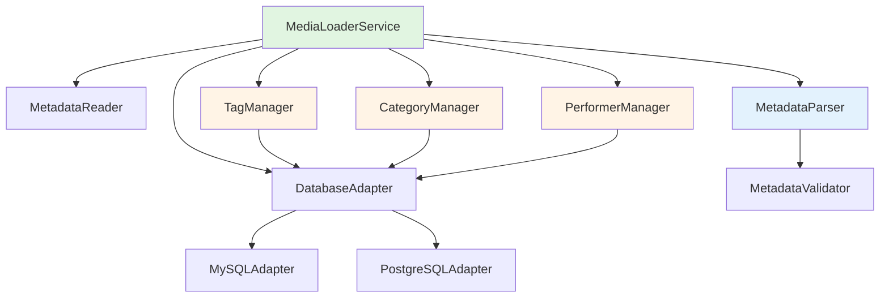

# Design Document

## Overview

The Rich Metadata Import feature enhances the existing media file metadata system by implementing a normalized database schema for tags, categories, and performers. This design replaces the current generic JSON metadata storage with structured relational tables that enable efficient querying and filtering.

The system will:
- Create four new normalized tables: `tags`, `categories`, `performers`, and three junction tables
- Add metadata-specific columns to the `media_files` table (display_name, provider, thumbnail, duration, etc.)
- Enhance the `MediaLoaderService` to parse rich metadata and populate these tables
- Maintain backward compatibility with existing media files
- Support both MySQL and PostgreSQL databases

This design integrates with the existing UUID-based media file system and preserves the current batch import workflow.

## Steering Document Alignment

### Technical Standards (tech.md)
No steering documents exist for this project. This design follows TypeScript best practices and maintains consistency with the existing codebase patterns.

### Project Structure (structure.md)
The implementation follows the existing project structure:
- Database migrations in `backend/src/migrations/`
- Database adapters in `backend/src/adapters/`
- Models in `backend/src/models/`
- Services in `backend/src/services/`
- Utilities in `backend/src/utils/`

## Code Reuse Analysis

### Existing Components to Leverage

- **DatabaseAdapter (MySQLAdapter, PostgreSQLAdapter)**: Will be used for all database operations. Supports parameterized queries and transactions.
- **MigrationRunner**: Will execute the new migration to create tables and add columns.
- **MediaLoaderService**: Will be enhanced to parse rich metadata and populate normalized tables.
- **MetadataReader**: Already reads `.info.json` files. Will be used without modification.
- **UUIDExtractor**: Already extracts UUIDs from filenames. Will be used without modification.
- **FileScanner**: Already scans directories for video files. Will be used without modification.

### Integration Points

- **media_files table**: New columns will be added via migration. Existing records remain valid.
- **MediaLoaderService batch processing**: Will be extended to handle tag/category/performer associations after inserting media file records.
- **Database transaction support**: Will use existing transaction methods for atomic operations.
- **Error handling and statistics**: Will extend existing statistics tracking in `LoaderStatistics` interface.

## Architecture

The architecture follows a layered approach with clear separation of concerns:

1. **Data Layer**: Database adapters handle all SQL operations
2. **Migration Layer**: Versioned migrations create/update schema
3. **Model Layer**: TypeScript interfaces define data structures
4. **Service Layer**: MediaLoaderService orchestrates import workflow
5. **Utility Layer**: Metadata parsing and validation utilities

### Modular Design Principles

- **Single File Responsibility**: Each utility handles one specific concern (tag management, category management, performer management)
- **Component Isolation**: New tag/category/performer management utilities are independent modules
- **Service Layer Separation**: MediaLoaderService coordinates but delegates to specialized utilities
- **Utility Modularity**: Create focused utilities for metadata parsing, validation, and normalization



## Components and Interfaces

### Component 1: Migration 003 - Rich Metadata Schema

- **Purpose:** Create normalized tables for tags, categories, performers and add columns to media_files
- **Location:** `backend/src/migrations/003_rich_metadata_schema.ts`
- **Tables Created:**
  - `tags` (id, name, created_at, updated_at)
  - `categories` (id, name, created_at, updated_at)
  - `performers` (id, name, created_at, updated_at)
  - `media_file_tags` (media_file_uuid, tag_id)
  - `media_file_categories` (media_file_uuid, category_id)
  - `media_file_performers` (media_file_uuid, performer_id)
- **Columns Added to media_files:**
  - `display_name` VARCHAR(255)
  - `provider` VARCHAR(100)
  - `provider_id` VARCHAR(255)
  - `webpage_url` VARCHAR(512)
  - `thumbnail` VARCHAR(512)
  - `duration` INT
  - `downloaded_format` VARCHAR(50)
  - `available_formats` JSON/JSONB
  - `creator` VARCHAR(255)
  - `primary_tag_id` INT (FK to tags.id)
- **Indexes:** All foreign key columns, name columns with case-insensitive unique constraints
- **Dependencies:** DatabaseAdapter
- **Reuses:** MigrationRunner, existing migration pattern

### Component 2: TagManager Utility

- **Purpose:** Manage tag CRUD operations and media file associations
- **Location:** `backend/src/utils/TagManager.ts`
- **Interfaces:**
  - `findOrCreateTag(name: string): Promise<number>` - Returns tag ID
  - `findOrCreateTags(names: string[]): Promise<number[]>` - Batch operation
  - `associateTagsWithMediaFile(uuid: string, tagIds: number[]): Promise<void>`
  - `getTagsForMediaFile(uuid: string): Promise<Tag[]>`
  - `removeMediaFileAssociations(uuid: string): Promise<void>`
  - `syncMediaFileTags(uuid: string, tagNames: string[]): Promise<void>` - Full sync (add new, remove old)
- **Dependencies:** DatabaseAdapter
- **Reuses:** Database transaction support for atomic operations

### Component 3: CategoryManager Utility

- **Purpose:** Manage category CRUD operations and media file associations
- **Location:** `backend/src/utils/CategoryManager.ts`
- **Interfaces:**
  - `findOrCreateCategory(name: string): Promise<number>` - Returns category ID
  - `findOrCreateCategories(names: string[]): Promise<number[]>` - Batch operation
  - `associateCategoriesWithMediaFile(uuid: string, categoryIds: number[]): Promise<void>`
  - `getCategoriesForMediaFile(uuid: string): Promise<Category[]>`
  - `removeMediaFileAssociations(uuid: string): Promise<void>`
  - `syncMediaFileCategories(uuid: string, categoryNames: string[]): Promise<void>` - Full sync
- **Dependencies:** DatabaseAdapter
- **Reuses:** Database transaction support

### Component 4: PerformerManager Utility

- **Purpose:** Manage performer CRUD operations and media file associations
- **Location:** `backend/src/utils/PerformerManager.ts`
- **Interfaces:**
  - `findOrCreatePerformer(name: string): Promise<number>` - Returns performer ID
  - `findOrCreatePerformers(names: string[]): Promise<number[]>` - Batch operation
  - `associatePerformersWithMediaFile(uuid: string, performerIds: number[]): Promise<void>`
  - `getPerformersForMediaFile(uuid: string): Promise<Performer[]>`
  - `removeMediaFileAssociations(uuid: string): Promise<void>`
  - `syncMediaFilePerformers(uuid: string, performerNames: string[]): Promise<void>` - Full sync
- **Dependencies:** DatabaseAdapter
- **Reuses:** Database transaction support

### Component 5: MetadataParser Utility

- **Purpose:** Parse and validate rich metadata from .info.json files
- **Location:** `backend/src/utils/MetadataParser.ts`
- **Interfaces:**
  - `parseRichMetadata(rawMetadata: any): ParsedRichMetadata` - Extracts structured metadata
  - `extractDisplayName(metadata: any): string` - display_name > title > filename fallback
  - `extractTags(metadata: any): string[]` - Normalizes tag names
  - `extractCategories(metadata: any): string[]` - Normalizes category names
  - `extractPerformers(metadata: any): string[]` - Extracts from pornstars array
  - `extractProviderInfo(metadata: any): ProviderInfo` - provider, id, webpage_url
  - `extractThumbnail(metadata: any): string | null` - Validates URL
  - `extractDuration(metadata: any): number | null` - Validates integer
  - `extractFormats(metadata: any): FormatInfo` - available_formats, downloaded_format
  - `validateMetadata(metadata: ParsedRichMetadata): ValidationResult` - Returns errors/warnings
- **Dependencies:** None (pure utility)
- **Reuses:** Existing metadata reading patterns from MetadataReader

### Component 6: Enhanced MediaLoaderService

- **Purpose:** Orchestrate rich metadata import workflow
- **Location:** `backend/src/services/MediaLoaderService.ts` (existing file, will be enhanced)
- **New Methods:**
  - `private async processRichMetadata(uuid: string, metadata: any): Promise<void>` - Parses and stores rich metadata
  - `private async syncAssociations(uuid: string, parsed: ParsedRichMetadata): Promise<void>` - Updates tag/category/performer associations
- **Enhanced Methods:**
  - `storeMediaFiles()` - Will call `processRichMetadata()` after storing basic media file info
- **Dependencies:** DatabaseAdapter, MetadataParser, TagManager, CategoryManager, PerformerManager
- **Reuses:** Existing batch processing, transaction support, error handling, statistics tracking

## Data Models

### Database Tables

#### tags Table
```sql
CREATE TABLE tags (
  id INT/SERIAL PRIMARY KEY AUTO_INCREMENT,
  name VARCHAR(100) NOT NULL,
  created_at TIMESTAMP DEFAULT CURRENT_TIMESTAMP,
  updated_at TIMESTAMP DEFAULT CURRENT_TIMESTAMP ON UPDATE CURRENT_TIMESTAMP,
  UNIQUE KEY idx_name_unique (name) -- Case-insensitive
);
CREATE INDEX idx_name ON tags(name);
```

#### categories Table
```sql
CREATE TABLE categories (
  id INT/SERIAL PRIMARY KEY AUTO_INCREMENT,
  name VARCHAR(100) NOT NULL,
  created_at TIMESTAMP DEFAULT CURRENT_TIMESTAMP,
  updated_at TIMESTAMP DEFAULT CURRENT_TIMESTAMP ON UPDATE CURRENT_TIMESTAMP,
  UNIQUE KEY idx_name_unique (name) -- Case-insensitive
);
CREATE INDEX idx_name ON categories(name);
```

#### performers Table
```sql
CREATE TABLE performers (
  id INT/SERIAL PRIMARY KEY AUTO_INCREMENT,
  name VARCHAR(255) NOT NULL,
  created_at TIMESTAMP DEFAULT CURRENT_TIMESTAMP,
  updated_at TIMESTAMP DEFAULT CURRENT_TIMESTAMP ON UPDATE CURRENT_TIMESTAMP,
  UNIQUE KEY idx_name_unique (name) -- Case-insensitive
);
CREATE INDEX idx_name ON performers(name);
```

#### media_file_tags Junction Table
```sql
CREATE TABLE media_file_tags (
  media_file_uuid VARCHAR(36) NOT NULL,
  tag_id INT NOT NULL,
  PRIMARY KEY (media_file_uuid, tag_id),
  FOREIGN KEY (media_file_uuid) REFERENCES media_files(uuid) ON DELETE CASCADE,
  FOREIGN KEY (tag_id) REFERENCES tags(id) ON DELETE CASCADE
);
CREATE INDEX idx_media_file_uuid ON media_file_tags(media_file_uuid);
CREATE INDEX idx_tag_id ON media_file_tags(tag_id);
```

#### media_file_categories Junction Table
```sql
CREATE TABLE media_file_categories (
  media_file_uuid VARCHAR(36) NOT NULL,
  category_id INT NOT NULL,
  PRIMARY KEY (media_file_uuid, category_id),
  FOREIGN KEY (media_file_uuid) REFERENCES media_files(uuid) ON DELETE CASCADE,
  FOREIGN KEY (category_id) REFERENCES categories(id) ON DELETE CASCADE
);
CREATE INDEX idx_media_file_uuid ON media_file_categories(media_file_uuid);
CREATE INDEX idx_category_id ON media_file_categories(category_id);
```

#### media_file_performers Junction Table
```sql
CREATE TABLE media_file_performers (
  media_file_uuid VARCHAR(36) NOT NULL,
  performer_id INT NOT NULL,
  PRIMARY KEY (media_file_uuid, performer_id),
  FOREIGN KEY (media_file_uuid) REFERENCES media_files(uuid) ON DELETE CASCADE,
  FOREIGN KEY (performer_id) REFERENCES performers(id) ON DELETE CASCADE
);
CREATE INDEX idx_media_file_uuid ON media_file_performers(media_file_uuid);
CREATE INDEX idx_performer_id ON media_file_performers(performer_id);
```

#### Enhanced media_files Table
```sql
ALTER TABLE media_files
  ADD COLUMN display_name VARCHAR(255),
  ADD COLUMN provider VARCHAR(100),
  ADD COLUMN provider_id VARCHAR(255),
  ADD COLUMN webpage_url VARCHAR(512),
  ADD COLUMN thumbnail VARCHAR(512),
  ADD COLUMN duration INT,
  ADD COLUMN downloaded_format VARCHAR(50),
  ADD COLUMN available_formats JSON/JSONB,
  ADD COLUMN creator VARCHAR(255),
  ADD COLUMN primary_tag_id INT,
  ADD FOREIGN KEY (primary_tag_id) REFERENCES tags(id) ON DELETE SET NULL;

CREATE INDEX idx_display_name ON media_files(display_name);
CREATE INDEX idx_provider ON media_files(provider);
CREATE INDEX idx_duration ON media_files(duration);
CREATE INDEX idx_primary_tag_id ON media_files(primary_tag_id);
```

### TypeScript Interfaces

#### Tag Model
```typescript
interface Tag {
  readonly id: number;
  name: string;
  readonly createdAt: Date;
  updatedAt: Date;
}
```

#### Category Model
```typescript
interface Category {
  readonly id: number;
  name: string;
  readonly createdAt: Date;
  updatedAt: Date;
}
```

#### Performer Model
```typescript
interface Performer {
  readonly id: number;
  name: string;
  readonly createdAt: Date;
  updatedAt: Date;
}
```

#### Enhanced MediaFile Model
```typescript
interface MediaFile {
  readonly uuid: string;
  filePath: string;
  fileName: string;
  fileSize: number | null;
  fileExtension: string | null;

  // New rich metadata fields
  displayName: string | null;
  provider: string | null;
  providerId: string | null;
  webpageUrl: string | null;
  thumbnail: string | null;
  duration: number | null;
  downloadedFormat: string | null;
  availableFormats: string[] | null;
  creator: string | null;
  primaryTagId: number | null;

  // Existing fields
  metadata: Record<string, unknown> | null;
  metadataFilePath: string | null;
  readonly createdAt: Date;
  updatedAt: Date;
  lastScannedAt: Date;

  // Virtual associations (populated via JOIN)
  tags?: Tag[];
  categories?: Category[];
  performers?: Performer[];
}
```

#### ParsedRichMetadata Interface
```typescript
interface ParsedRichMetadata {
  displayName: string;
  provider: string | null;
  providerId: string | null;
  webpageUrl: string | null;
  thumbnail: string | null;
  duration: number | null;
  downloadedFormat: string | null;
  availableFormats: string[];
  creator: string | null;
  primaryTag: string | null;
  tags: string[];
  categories: string[];
  performers: string[];
}
```

#### ProviderInfo Interface
```typescript
interface ProviderInfo {
  provider: string | null;
  providerId: string | null;
  webpageUrl: string | null;
}
```

#### FormatInfo Interface
```typescript
interface FormatInfo {
  downloadedFormat: string | null;
  availableFormats: string[];
}
```

#### ValidationResult Interface
```typescript
interface ValidationResult {
  isValid: boolean;
  errors: string[];
  warnings: string[];
}
```

#### Enhanced LoaderStatistics Interface
```typescript
interface LoaderStatistics {
  // Existing fields
  filesScanned: number;
  filesProcessed: number;
  filesWithUUID: number;
  filesWithoutUUID: number;
  filesWithMetadata: number;
  filesWithoutMetadata: number;
  recordsInserted: number;
  recordsUpdated: number;
  recordsUnchanged: number;
  errors: number;
  errorMessages: string[];
  startTime: Date;
  endTime?: Date;
  durationMs?: number;

  // New fields for rich metadata
  tagsCreated: number;
  categoriesCreated: number;
  performersCreated: number;
  associationsCreated: number;
  associationsRemoved: number;
}
```

## Error Handling

### Error Scenarios

1. **Malformed Metadata JSON**
   - **Handling:** Catch parsing error, log with file path, continue processing other files
   - **User Impact:** File imported with basic info only (no rich metadata), error logged in statistics

2. **Database Constraint Violation (Unique Name)**
   - **Handling:** Catch duplicate key error, fetch existing record by name, use existing ID
   - **User Impact:** Tag/category/performer reused (expected behavior), no user-visible error

3. **Foreign Key Constraint Violation**
   - **Handling:** Log error, skip association creation, continue with other associations
   - **User Impact:** Some associations may be missing, error logged in statistics

4. **Invalid URL Format (Thumbnail/Webpage URL)**
   - **Handling:** Validate URL using regex, store NULL if invalid, log warning
   - **User Impact:** No thumbnail displayed, URL field empty, warning in logs

5. **Invalid Duration Value (Non-numeric)**
   - **Handling:** Validate type, use NULL if invalid, log warning
   - **User Impact:** Duration not displayed, warning in logs

6. **Transaction Rollback Failure**
   - **Handling:** Log critical error, halt batch processing, report to user
   - **User Impact:** Batch import stops, user notified to check database state

7. **Case-Insensitive Duplicate Handling**
   - **Handling:** Use LOWER(name) in unique constraint, normalize names to lowercase before insert
   - **User Impact:** "Action" and "action" treated as same tag/category

8. **Missing Required Fields in Metadata**
   - **Handling:** Use sensible defaults (display_name defaults to title or filename)
   - **User Impact:** File imported successfully with fallback values

9. **Orphaned Tags/Categories/Performers**
   - **Handling:** Optional cleanup job to remove records with no associations
   - **User Impact:** None (internal database cleanup)

10. **Primary Tag Not in Tags Array**
    - **Handling:** If primary_tag not found in tags array, create tag and add to associations
    - **User Impact:** Primary tag always appears in tags list

## Testing Strategy

### Unit Testing

**Test Files:**
- `TagManager.test.ts` - Test tag CRUD operations, duplicate handling, case-insensitive matching
- `CategoryManager.test.ts` - Test category CRUD operations, duplicate handling
- `PerformerManager.test.ts` - Test performer CRUD operations, duplicate handling
- `MetadataParser.test.ts` - Test parsing logic, fallback values, validation

**Key Tests:**
- Case-insensitive tag/category/performer matching ("Action" vs "action")
- Duplicate detection and reuse
- NULL handling for optional fields
- Array parsing and normalization
- URL validation
- Duration validation
- Display name fallback logic (display_name > title > filename)
- Empty array handling

### Integration Testing

**Test Files:**
- `MediaLoaderService.integration.test.ts` - Test full import workflow with rich metadata

**Key Flows:**
1. Import new media file with full rich metadata
2. Update existing media file with changed tags/categories/performers
3. Import media file with minimal metadata (test defaults)
4. Import batch of files with mixed metadata completeness
5. Verify transaction rollback on error
6. Verify associations are created correctly
7. Verify associations are removed when metadata changes
8. Verify case-insensitive matching works

### End-to-End Testing

**Test Scenarios:**
1. **Full Import Workflow:**
   - Scan directory with video files
   - Read .info.json metadata files
   - Parse rich metadata
   - Create database records
   - Verify all associations created
   - Verify query performance

2. **Update Workflow:**
   - Import files
   - Modify metadata files (add/remove tags)
   - Re-import
   - Verify associations updated correctly

3. **Error Recovery:**
   - Import with malformed metadata
   - Verify other files still imported
   - Verify statistics report errors correctly

4. **Query Performance:**
   - Import 1,000+ files with tags/categories/performers
   - Query by tag (should use JOIN, not JSON parsing)
   - Query by category (should use JOIN)
   - Query by performer (should use JOIN)
   - Verify queries complete in < 500ms

5. **Migration Testing:**
   - Run migration on empty database
   - Run migration on database with existing media_files
   - Verify backward compatibility
   - Verify foreign key constraints work

## Migration Strategy

### Migration Execution Order

1. **Create normalized tables** (tags, categories, performers)
2. **Create junction tables** (media_file_tags, media_file_categories, media_file_performers)
3. **Add columns to media_files table**
4. **Create indexes** for performance
5. **Add foreign key constraints** (with CASCADE DELETE)

### Rollback Strategy

- Migration includes `down()` method to drop tables and columns
- Transaction-based execution ensures atomicity
- Test rollback on staging environment before production deployment

### Data Migration

- Existing `media_files` records remain valid (new columns default to NULL)
- No data migration needed initially
- Next import run will populate rich metadata for existing files

## Performance Considerations

### Query Optimization

- **Indexes:** All foreign key columns indexed for JOIN performance
- **Unique Constraints:** Enable fast lookups when checking for existing tags/categories/performers
- **Batch Inserts:** Use batch operations for junction table inserts (reduce round trips)

### Batch Processing

- Maintain existing batch size of 100 files per transaction
- Process associations after media file insert (same transaction)
- Use `findOrCreateTags()` batch method instead of individual calls

### Memory Management

- Keep tag/category/performer names in memory during batch (cache for deduplication)
- Clear cache after each batch to prevent memory growth
- Limit metadata JSON size (warn if > 1MB)

### Expected Performance

- **Import Speed:** < 10 seconds for 100 files with rich metadata
- **Query Speed:** < 500ms for filtering 100,000 files by tag/category/performer
- **Database Growth:** ~3-5 new rows per media file (tags + categories + performers)

## Database-Specific Considerations

### MySQL

- Use `AUTO_INCREMENT` for primary keys
- Use `JSON` type for available_formats
- Use `ON UPDATE CURRENT_TIMESTAMP` for updated_at
- Use `LOWER()` function for case-insensitive unique constraints

### PostgreSQL

- Use `SERIAL` for primary keys
- Use `JSONB` type for available_formats (better query performance)
- Use trigger for updated_at timestamp
- Use `CITEXT` extension or `LOWER()` for case-insensitive unique constraints

## Security Considerations

- **SQL Injection Prevention:** Use parameterized queries (enforced by DatabaseAdapter)
- **URL Validation:** Validate thumbnail and webpage URLs before storing
- **Input Sanitization:** Trim and normalize tag/category/performer names
- **Path Validation:** Ensure metadata file paths are within expected directory
