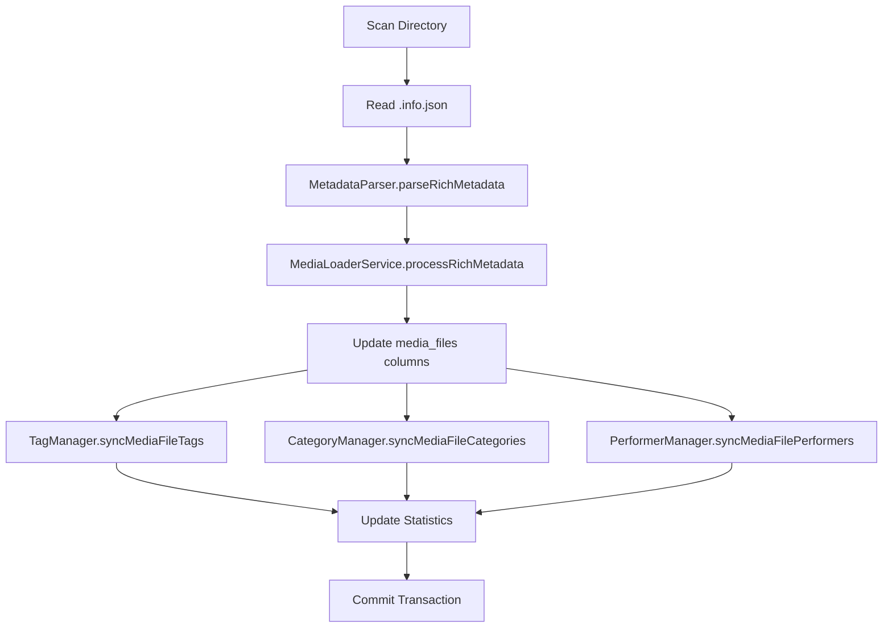

# Rich Metadata Import - Complete Specification Summary

> **Complete overview of the Rich Metadata Import feature**

---

## Executive Summary

Transform the media player's metadata system from JSON-based storage to a normalized relational database schema. This enables fast querying, prevents duplicates, and provides a foundation for advanced filtering and search capabilities.

### Business Value
- **Fast Queries**: JOIN-based queries instead of JSON parsing (target <500ms for 100k videos)
- **Better Organization**: Tags, categories, and performers as first-class entities
- **No Duplicates**: Case-insensitive matching prevents "Action" vs "action"
- **Scalability**: Efficient for large video libraries (100k+ files)

---

## Current vs New System

### Current System ❌
```
media_files table:
- metadata (JSON) = { tags: [...], categories: [...], ... }

Problems:
- Slow queries (must parse JSON)
- Duplicates possible ("Action" vs "action")
- No referential integrity
- Hard to find "all videos with tag X"
```

### New System ✅
```
tags table (id, name)
categories table (id, name)
performers table (id, name)
media_file_tags (many-to-many junction)
media_file_categories (many-to-many junction)
media_file_performers (many-to-many junction)

Benefits:
- Fast JOIN queries
- Case-insensitive unique constraints
- Referential integrity (CASCADE DELETE)
- Easy to find "all videos with tag X"
- Tag/category/performer can have additional metadata
```

---

## Requirements (11 Total)

### 1. Store Display Names
- Human-readable titles (not just UUID filenames)
- Fallback: display_name > title > filename

### 2. Store Provider Information
- Track video source (pornhub, youtube, etc.)
- Store provider ID and original URL
- Filter videos by provider

### 3. Store Tags and Categories in Normalized Tables ⭐
- Separate `tags` and `categories` tables
- Junction tables for many-to-many relationships
- Case-insensitive unique names
- Fast JOIN queries

### 4. Store Thumbnail Information
- Store thumbnail URLs for visual preview
- Validate URL format

### 5. Store Duration Information
- Video length in seconds
- Format as HH:MM:SS for display
- Filter by duration range

### 6. Store Format Information
- Available formats (240p, 480p, 720p, etc.)
- Downloaded format
- Stored as JSON array

### 7. Store Performer/Creator Information in Normalized Tables ⭐
- Separate `performers` table
- Junction table for many-to-many
- Case-insensitive matching

### 8. Define Normalized Table Schemas ⭐
- Explicit schemas for all tables
- Foreign keys with CASCADE DELETE
- Indexes on all searchable columns
- Case-insensitive unique constraints

### 9. Update Existing Records
- Smart updates without duplicates
- Add new associations, remove old ones
- Only update `updated_at` if data changed
- Always update `last_scanned_at`

### 10. Handle Missing Metadata Gracefully
- Partial metadata still imports successfully
- Use sensible defaults
- Log errors, continue processing

### 11. Maintain Backward Compatibility
- Existing media_files records remain valid
- New columns default to NULL
- Service works if metadata missing

---

## Database Schema

### New Tables (6 Total)

#### tags
```sql
CREATE TABLE tags (
  id INT/SERIAL PRIMARY KEY AUTO_INCREMENT,
  name VARCHAR(100) NOT NULL,
  created_at TIMESTAMP DEFAULT CURRENT_TIMESTAMP,
  updated_at TIMESTAMP DEFAULT CURRENT_TIMESTAMP ON UPDATE CURRENT_TIMESTAMP,
  UNIQUE KEY idx_name_unique (LOWER(name))  -- Case-insensitive
);
CREATE INDEX idx_name ON tags(name);
```

#### categories
Same structure as `tags`.

#### performers
```sql
CREATE TABLE performers (
  id INT/SERIAL PRIMARY KEY AUTO_INCREMENT,
  name VARCHAR(255) NOT NULL,  -- Longer for full names
  created_at TIMESTAMP DEFAULT CURRENT_TIMESTAMP,
  updated_at TIMESTAMP DEFAULT CURRENT_TIMESTAMP ON UPDATE CURRENT_TIMESTAMP,
  UNIQUE KEY idx_name_unique (LOWER(name))
);
CREATE INDEX idx_name ON performers(name);
```

#### media_file_tags (junction)
```sql
CREATE TABLE media_file_tags (
  media_file_uuid VARCHAR(36) NOT NULL,
  tag_id INT NOT NULL,
  PRIMARY KEY (media_file_uuid, tag_id),
  FOREIGN KEY (media_file_uuid) REFERENCES media_files(uuid) ON DELETE CASCADE,
  FOREIGN KEY (tag_id) REFERENCES tags(id) ON DELETE CASCADE
);
CREATE INDEX idx_media_file_uuid ON media_file_tags(media_file_uuid);
CREATE INDEX idx_tag_id ON media_file_tags(tag_id);
```

#### media_file_categories (junction)
Same structure as `media_file_tags` (change tag_id to category_id).

#### media_file_performers (junction)
Same structure as `media_file_tags` (change tag_id to performer_id).

### Enhanced media_files Table

**Add 10 new columns:**

| Column | Type | Purpose |
|--------|------|---------|
| display_name | VARCHAR(255) | Human-readable title |
| provider | VARCHAR(100) | Source provider (pornhub, youtube) |
| provider_id | VARCHAR(255) | Provider's video ID |
| webpage_url | VARCHAR(512) | Original source URL |
| thumbnail | VARCHAR(512) | Thumbnail image URL |
| duration | INT | Video length in seconds |
| downloaded_format | VARCHAR(50) | Format downloaded (720p, etc.) |
| available_formats | JSON/JSONB | Array of available formats |
| creator | VARCHAR(255) | Video creator/uploader |
| primary_tag_id | INT | FK to tags(id), main category |

**Indexes:**
- `idx_display_name` ON media_files(display_name)
- `idx_provider` ON media_files(provider)
- `idx_duration` ON media_files(duration)
- `idx_primary_tag_id` ON media_files(primary_tag_id)

---

## Architecture

### Components

#### 1. Migration 003
**File**: `backend/src/migrations/003_rich_metadata_schema.ts`

Creates all 6 tables, adds 10 columns to media_files, creates indexes and foreign keys. Supports both MySQL and PostgreSQL.

#### 2. TypeScript Models
**Files**: `backend/src/models/Tag.ts`, `Category.ts`, `Performer.ts`, `MediaFile.ts` (enhanced)

Type-safe interfaces for all data structures.

#### 3. TagManager
**File**: `backend/src/utils/TagManager.ts`

Manages tag CRUD and associations:
- `findOrCreateTag(name: string): Promise<number>`
- `syncMediaFileTags(uuid: string, tagNames: string[]): Promise<void>`
- Case-insensitive matching
- Transaction-safe operations

#### 4. CategoryManager
**File**: `backend/src/utils/CategoryManager.ts`

Mirrors TagManager for categories. Identical structure for consistency.

#### 5. PerformerManager
**File**: `backend/src/utils/PerformerManager.ts`

Mirrors TagManager for performers. Identical structure for consistency.

#### 6. MetadataParser
**File**: `backend/src/utils/MetadataParser.ts`

Pure functions for parsing and validating metadata:
- `parseRichMetadata(rawMetadata: any): ParsedRichMetadata`
- `extractDisplayName()`, `extractTags()`, `extractCategories()`, etc.
- Handles missing fields gracefully
- Validates URLs and integers

#### 7. MediaLoaderService (Enhanced)
**File**: `backend/src/services/MediaLoaderService.ts` (modify existing)

Orchestrates the import workflow:
- Calls MetadataParser to parse rich metadata
- Updates media_files columns
- Calls TagManager, CategoryManager, PerformerManager to create associations
- All within transaction for atomicity
- Error handling doesn't stop batch

### Data Flow



---

## Key Design Decisions

### 1. Case-Insensitive Matching
**Problem**: Users might tag videos with "Action", "action", "ACTION"
**Solution**: Normalize to lowercase, use LOWER() in unique constraints
**Result**: Only one "action" tag exists in database

### 2. Junction Tables
**Problem**: Videos have multiple tags, tags apply to multiple videos (many-to-many)
**Solution**: Junction tables with composite primary keys
**Result**: Efficient queries, no data duplication

### 3. CASCADE DELETE
**Problem**: What happens when video is deleted?
**Solution**: Foreign keys with ON DELETE CASCADE
**Result**: Junction table records automatically deleted, no orphans

### 4. Transaction Safety
**Problem**: Creating video + associations involves multiple operations
**Solution**: Wrap in transaction, rollback on any failure
**Result**: All-or-nothing, no partial imports

### 5. Graceful Degradation
**Problem**: Some metadata files might be incomplete
**Solution**: Parse what exists, use defaults, log errors, continue batch
**Result**: Partial metadata better than no import

### 6. Manager Utility Pattern
**Problem**: TagManager, CategoryManager, PerformerManager do similar things
**Solution**: Identical structure across all three managers
**Result**: Consistent, maintainable, easy to understand

---

## Implementation Tasks (12 Total)

### Phase 1: Database & Models (Tasks 1-2)
1. Create migration with all tables
2. Define TypeScript interfaces

### Phase 2: Business Logic (Tasks 3-7)
3. Implement TagManager
4. Implement CategoryManager
5. Implement PerformerManager
6. Implement MetadataParser
7. Enhance MediaLoaderService

### Phase 3: Testing (Tasks 8-12)
8. TagManager unit tests
9. CategoryManager & PerformerManager unit tests
10. MetadataParser unit tests
11. MediaLoaderService integration tests
12. E2E tests (API queries, performance)

---

## Example Metadata JSON

From `.info.json` file:
```json
{
  "stored_name": "0b4accfa-4ce3-4511-b8e5-25b3167b5298",
  "display_name": "Secretaries 4 - Scene 3",
  "title": "Secretaries 4 - Scene 3",
  "tags": [
    "brunette",
    "hungarian",
    "raven",
    "bubble butt",
    "secretary",
    "office",
    "blowjob"
  ],
  "categories": [
    "Big Ass",
    "Big Tits",
    "Brunette",
    "HD Porn",
    "Hardcore",
    "MILF",
    "Pornstar"
  ],
  "pornstars": [],
  "extension": "mp4",
  "id": "ph5952b413d0f8e",
  "thumbnail": "https://ei.phncdn.com/videos/.../12.jpg",
  "duration": 1404,
  "webpage_url": "https://www.pornhub.com/view_video.php?viewkey=ph5952b413d0f8e",
  "formats": ["240p", "hls-447", "480p", "720p", "hls-2054"],
  "downloaded_format": "hls-2054",
  "provider": "pornhub",
  "primary_tag": "Combat_Zone"
}
```

### How This Maps to Database

1. **media_files table**:
   - uuid: `0b4accfa-4ce3-4511-b8e5-25b3167b5298`
   - display_name: `"Secretaries 4 - Scene 3"`
   - provider: `"pornhub"`
   - provider_id: `"ph5952b413d0f8e"`
   - webpage_url: `"https://..."`
   - thumbnail: `"https://..."`
   - duration: `1404`
   - downloaded_format: `"hls-2054"`
   - available_formats: `["240p", "480p", "720p", ...]`

2. **tags table** (find or create):
   - `brunette`, `hungarian`, `raven`, `bubble butt`, `secretary`, `office`, `blowjob`

3. **media_file_tags junction**:
   - 7 records linking UUID to each tag ID

4. **categories table** (find or create):
   - `Big Ass`, `Big Tits`, `Brunette`, `HD Porn`, `Hardcore`, `MILF`, `Pornstar`

5. **media_file_categories junction**:
   - 7 records linking UUID to each category ID

6. **performers table**:
   - Empty array, no records created

7. **primary_tag**:
   - Find or create tag "Combat_Zone"
   - Set media_files.primary_tag_id to its ID

---

## Query Examples

### Find all videos with tag "brunette"
```sql
SELECT m.*
FROM media_files m
JOIN media_file_tags mt ON m.uuid = mt.media_file_uuid
JOIN tags t ON mt.tag_id = t.id
WHERE LOWER(t.name) = 'brunette';
```

### Find all tags for a video
```sql
SELECT t.*
FROM tags t
JOIN media_file_tags mt ON t.id = mt.tag_id
WHERE mt.media_file_uuid = '0b4accfa-4ce3-4511-b8e5-25b3167b5298';
```

### Find videos by multiple tags (AND logic)
```sql
SELECT m.*
FROM media_files m
JOIN media_file_tags mt1 ON m.uuid = mt1.media_file_uuid
JOIN tags t1 ON mt1.tag_id = t1.id AND LOWER(t1.name) = 'brunette'
JOIN media_file_tags mt2 ON m.uuid = mt2.media_file_uuid
JOIN tags t2 ON mt2.tag_id = t2.id AND LOWER(t2.name) = 'office';
```

### Count videos per tag
```sql
SELECT t.name, COUNT(mt.media_file_uuid) as video_count
FROM tags t
LEFT JOIN media_file_tags mt ON t.id = mt.tag_id
GROUP BY t.id, t.name
ORDER BY video_count DESC;
```

---

## Performance Targets

### Import Performance
- **100 files**: < 10 seconds
- **1,000 files**: < 90 seconds
- **10,000 files**: < 15 minutes

### Query Performance
- **Filter by tag** (10k videos): < 100ms
- **Filter by tag** (100k videos): < 500ms
- **Filter by multiple tags**: < 1 second
- **Count by tag**: < 200ms

### Database Growth
- **Per video**: ~3-10 new rows (tags + categories + performers + junction records)
- **100k videos**: ~500k-1M total rows across all tables
- **Indexes**: Ensure fast queries even at scale

---

## Error Handling Strategy

### Metadata Parsing Errors
- **Problem**: Invalid JSON, missing fields
- **Handling**: Log error, use defaults, continue batch
- **User Impact**: Video imported with basic info only

### Database Errors
- **Problem**: Constraint violations, connection errors
- **Handling**: Rollback transaction, log error, stop batch
- **User Impact**: Batch fails, must be retried

### Duplicate Key Errors
- **Problem**: Tag "action" already exists
- **Handling**: Catch error, query existing tag, reuse ID
- **User Impact**: None (expected behavior)

### Missing Metadata Files
- **Problem**: .info.json doesn't exist
- **Handling**: Import video without rich metadata
- **User Impact**: Video listed but no tags/categories

---

## Testing Strategy

### Unit Tests (Tasks 8-10)
- **TagManager**: Test all methods, mock DatabaseAdapter
- **CategoryManager**: Mirror TagManager tests
- **PerformerManager**: Mirror TagManager tests
- **MetadataParser**: Test all extraction functions, edge cases
- **Target**: >80% code coverage

### Integration Tests (Task 11)
- **Full Workflow**: Scan → Parse → Store → Verify
- **Update Scenario**: Import, modify metadata, re-import
- **Error Handling**: Invalid metadata, database errors
- **Statistics**: Verify counts accurate
- **Target**: All workflows pass, transactions work

### E2E Tests (Task 12)
- **API Queries**: Filter by tag/category/performer
- **Performance**: Measure query time
- **Display**: Verify display names shown
- **Thumbnails**: Verify URLs returned
- **Target**: User-facing functionality validated

---

## Success Criteria

### Functional Requirements ✅
- [ ] Migration creates all 6 tables
- [ ] 10 columns added to media_files
- [ ] Tags/categories/performers import correctly
- [ ] Case-insensitive matching prevents duplicates
- [ ] Associations created correctly
- [ ] Queries return correct results
- [ ] Backward compatible (existing data works)

### Performance Requirements ✅
- [ ] Import 100 files in <10 seconds
- [ ] Queries on 100k videos in <500ms
- [ ] No memory leaks
- [ ] Indexes improve query performance

### Code Quality ✅
- [ ] All TypeScript compiles without errors
- [ ] No SQL injection vulnerabilities
- [ ] Transactions used for multi-step operations
- [ ] Error handling doesn't break batch
- [ ] >80% test coverage
- [ ] Code follows project conventions

### Documentation ✅
- [ ] All functions have JSDoc comments
- [ ] README updated with new features
- [ ] API documentation updated
- [ ] Migration instructions clear

---

## Next Steps

1. **Read This Document**: Understand the complete specification
2. **Read PROMPT.md**: Get context for Claude Web
3. **Read TASKS.md**: See task checklist
4. **Study Specification Files**:
   - `.spec-workflow/specs/rich-metadata-import/requirements.md`
   - `.spec-workflow/specs/rich-metadata-import/design.md`
   - `.spec-workflow/specs/rich-metadata-import/tasks.md`
5. **Start Implementation**: Begin with Task 1 (Database Migration)

---

## Questions?

Refer to detailed documentation:
- **Requirements**: `.spec-workflow/specs/rich-metadata-import/requirements.md`
- **Design**: `.spec-workflow/specs/rich-metadata-import/design.md`
- **Tasks**: `.spec-workflow/specs/rich-metadata-import/tasks.md`
- **Quick Start**: `docs/rich-metadata-import/PROMPT.md`
